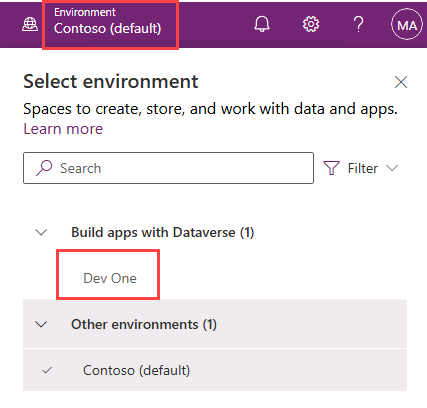

---
lab:
  title: 'النشاط المعملي 0: التحقق من بيئة النشاط المعملي.'
  module: 'Module 0: Course Introduction'
---

# التمرين المعملي 0 - التحقق من صحة بيئة المختبر

> **هام:** يوفر لك هذا التمرين المعملي مستأجر Microsoft 365 وتراخيص لتطبيقات Power Platform التي ستستخدمها في هذه الدورة التدريبية. سيتم تزويدك بمستأجر واحد فقط لمختبرات التدريب في هذه الدورة التدريبية. لا تتراجع الإعدادات والإجراءات التي تتخذها داخل هذا المستأجر أو تعيد تعيينها، في حين أن الجهاز الظاهري الذي يتم تزويدك به يقوم بإعادة التعيين في كل مرة تقوم فيها بإغلاق جلسة العمل المعملية. يرجى العلم بأن Microsoft 365 وPower Platform يتطوران طوال الوقت. تختلف التعليمات الواردة في هذا المستند عما تواجهه في المستأجر الفعلي. من الممكن أيضًا أن تواجه تأخير عدة دقائق قبل اتصال الجهاز الظاهري بالشبكة لبدء الأنشطة المعملية.

## مستأجرو WWL - شروط الاستخدام

إذا تم تزويدك بحساب مستأجر كجزء من تقديم تدريب بقيادة مدرب، يرجى ملاحظة أن حساب المستأجر متاح لغرض دعم الأنشطة المعملية ضمن التدريب بقيادة المدرب.

يجب عدم مشاركة حسابات المستأجر أو استخدامها لأغراض خارج الأنشطة المعملية. حساب المستأجر المستخدم في هذه الدورة التدريبية هو حساب مستأجر تجريبي، ولا يجوز استخدامه أو الوصول إليه بعد انتهاء الفصل وهو غير مؤهل للتمديد.

يجب عدم تحويل حسابات المستأجر إلى اشتراك مدفوع. تظل حسابات المستأجر التي تم الحصول عليها كجزء من هذه الدورة التدريبية ملكًا لشركة Microsoft Corporation ونحتفظ بالحق في الوصول إليها واستعادة ملكيتها في أي وقت.

## التمرين 1: الوصول إلى Microsoft Power Platform

في هذا التمرين، ستتحقق من أنه يمكنك الوصول إلى Power Apps.

### المهمة 1.1 – تسجيل الدخول إلى Power Apps

1. تحقق من توفر **بيانات اعتماد Microsoft 365** من مضيف المختبر المعتمد. ستكون بيانات الاعتماد في **علامة التبويب الموارد** .

1. في علامة تبويب متصفح جديدة، انتقل إلى `https://powerapps.microsoft.com`

1. حدد **تسجيل الدخول**.

1. أدخل عنوان البريد الإلكتروني الذي يوفره مضيف المختبر المعتمد.

1. حدد **التالي**.

1. أدخل كلمة المرور التي يوفرها مضيف المختبر المعتمد.

1. حدد **تسجيل الدخول**.

1. اختياريًا، حدد **نعم** للبقاء قيد تسجيل الدخول.

1. إذا تمت مطالبتك بتسجيل الدخول إلى **Microsoft Edge**، فحدد **لا، شكرا**.

1. إذا تمت مطالبتك بمعلومات جهة الاتصال، فاترك البلد/المنطقة كقيمة افتراضية وأدخل `0123456789` رقم الهاتف وحدد **إرسال**.

1. في الجزء العلوي الأيسر من الشاشة، تحقق من تعيين **البيئة** إلى **Dev One**. هذا هو المكان الذي ستعمل فيه على كامل هذا المختبر. إذا لم يكن كذلك، فحدد **بيئة Dev One** .

    

1. **أغلق جزء تحديد البيئة**.

### المهمة 1.2 – تحديث المستعرض

تطبيق آخر التحديثات على المتصفح يمنع المشكلات في المختبر التالي عند إنشاء التطبيقات.

1. افتح **مستعرض Microsoft Edge** .

1. **حدد الأوامر (...)** في الجزء العلوي الأيسر من المستعرض، وحدد **التعليمات والملاحظات**، وحدد **حول Microsoft Edge**.

1. تطبيق التحديثات وإعادة تشغيل المستعرض إذا لزم الأمر.

## التمرين 2: تنزيل الصور

1. افتح نافذة مستعرض في المستأجر الخاص بك، وأدخل https://github.com/MicrosoftLearning/PL-900-Microsoft-Power-Platform-Fundamentals/tree/master/Allfiles.
1. سترى الصور في لقطة الشاشة.

    

1. افتح كل صورة بشكل منفصل وقم بالتنزيل عن طريق تحديد أيقونة **التنزيل** .

    
