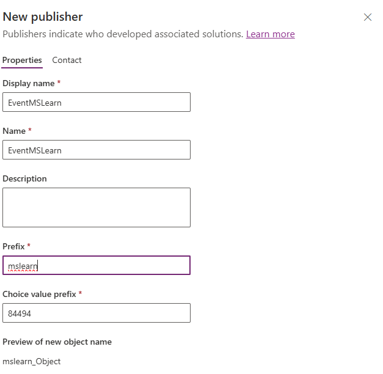

---
lab:
  title: 'التمرين المعملي 1: إنشاء حل'
  learning path: 'Learning Path: Manage the Microsoft Power Platform environment'
  module: 'Module 1: Describe Microsoft Dataverse'
---

## هدف التعلم

في هذا التمرين، ستقوم بإنشاء حل Power Platform لتخزين المكونات المختلفة التي تنشئها. في Power Platform، يتم استخدام الحلول لتجميع مكونات مختلفة معا، وتوفير إمكانية النقل. سيتم استخدام الحل الذي تقوم بإنشائه في هذا التمرين خلال بقية الدورة التدريبية.

### السيناريو

Contoso Consulting هي مؤسسة خدمات مهنية متخصصة في تكنولوجيا المعلومات والخدمات الاستشارية الذكاء الاصطناعي. على مدار العام، يقدمون العديد من الأحداث المختلفة لعملائها. بعض هذه هي التجارة يظهر الأحداث نمط حيث لديهم العديد من الشركاء تأتي في وتقديم تفاصيل عن المنتجات الجديدة، واتجاهات السوق، والخدمات. تحدث الندوات الأخرى على مدار العام وهي ندوات عبر الإنترنت سريعة تستخدم لتوفير تفاصيل حول المنتجات الفردية.

ترغب شركة Contoso في استخدام Power Platform لإنشاء حل إدارة الأحداث الذي يمكنهم استخدامه لإدارة الأحداث المختلفة التي يستضيفونها على مدار العام.

في هذا التمرين، يمكنك إنشاء حل سيتم استخدامه لإدارة دورة حياة التطبيق (ALM)، ولجمع جميع التطبيقات والمواقع والتدفق المختلفة التي نقوم بإنشائها معا حتى يمكن إدارتها ونقلها بسهولة.

الوقت المقدر لإكمال هذا التمرين هو **15 إلى 20** دقيقة.

عند الانتهاء بنجاح من هذا التمرين، سوف:

- إنشاء حل إدارة الأحداث
- أضف جدولي الحساب والاتصال الموجودين إلى الحل.
- إنشاء جدول جديد يسمى الأحداث من داخل الحل.

## المهمة 1: إنشاء حل إدارة الأحداث

1.  افتح [مدخل المنشئ في Power Apps](https://make.powerapps.com).
2.  انتقل إلى **الحلول**.
3.  في شريط الأوامر، حدد **New Solution.**
4.  في شاشة الحل الجديدة، قم بتكوين كما يلي:
    - **اسم العرض:** إدارة الأحداث
    - **الاسم:** إدارة الأحداث
5.  ضمن **Publisher**، حدد **+ New publisher**
6.  تكوين الناشر الجديد كما يلي
    - **اسم العرض:** EventMSLearn
    - **الاسم:** EverntMSLearn
    - **البادئة:** mslearn
    - **بادئة قيمة الاختيار:** اترك الإعداد الافتراضي

7.  **حدد الزر حفظ** لحفظ الناشر.
8.  في **حقل Publisher** ، حدد **ناشر EventMSlearn** الذي أنشأته للتو.
9.  حدد **تعيين كحل** مفضل.

10.  حدد **Create** لإنشاء الحل.

## المهمة 2: إضافة مكونات موجودة إلى حل.

الآن بعد أن أنشأنا حلا لتخزين مكوناتنا، سنقوم بإضافة بعض الجداول الموجودة إليه. سنضيف جدولي الحساب والاتصال، بحيث يمكن استخدامها بسهولة في تطبيقات وتدفقات ومواقع إدارة الأحداث المختلفة. أولا، سنضيف جدول الحساب إلى الحل.

1.  إذا لزم الأمر، فانتقل إلى حل إدارة** الأحداث الذي **أنشأته في المهمة السابقة.
2.  في **شريط** الأوامر، حدد **إضافة موجود.**
3.  من القائمة التي تظهر، حدد **جدول.**
4.  **حدد جدول الحساب**، ثم حدد **التالي.**
5.  في **شاشة Select Tables** ، حدد **Include all objects.**
6.  حدد **إضافة**.

الآن بعد أن أصبح لدينا جدول الحساب، سنضيف جدول جهات الاتصال.

7.  في **شريط** الأوامر، حدد **الزر إضافة موجود** مرة أخرى.
8.  من القائمة التي تظهر، حدد **جدول.**
9.  **حدد جدول جهات الاتصال**، ثم حدد **التالي.**
10.  في **شاشة تحديد الجداول** ، حدد **تضمين كافة الكائنات**
11.  حدد **إضافة**

تهانينا. لقد نجحت في إنشاء حل جديد باستخدام Power Platform. سنواصل استخدام الحل لإضافة مكونات إضافية إليه.
