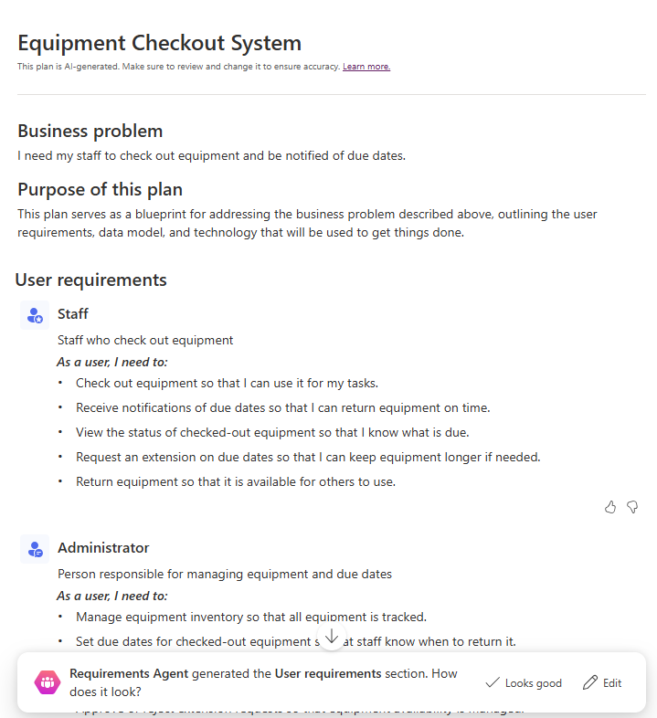
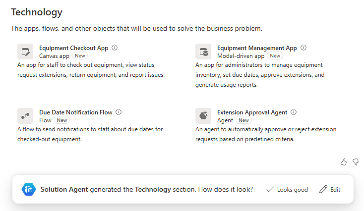
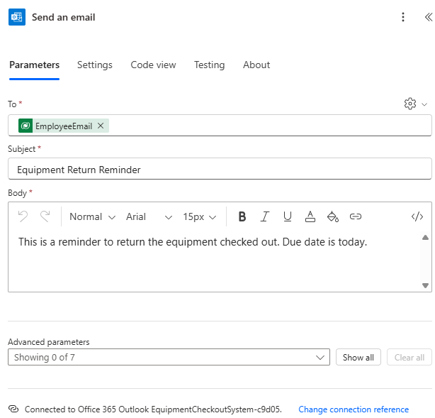

---
lab:
  title: 'التمرين المعملي 1: إنشاء حل باستخدام مصمم الخطة'
  learning path: 'Learning Path: Describe the business value of Microsoft Power Platform'
  module: 'Module 2: Describe the business value of extending business solutions by using Microsoft Power Platform'
---

## هدف التعلم

في هذا التمرين، سيستخدم المتعلمون مصمم الخطة لإنشاء حل عمل كامل ومستهدف يمكن أن يتضمن التطبيقات ومهام سير العمل والوكلاء والمزيد. سيرشدك Copilot خلال العملية بأكملها لإنشاء الحل.

عند الانتهاء بنجاح من هذا المختبر، سوف:

- استخدم مصمم الخطة لإنشاء حل.
- استخدم عامل البيانات لإنشاء نموذج بيانات.
- استخدم عامل الحل لإنشاء المكونات المختلفة المطلوبة.

### السيناريو

Contoso Consulting هي مؤسسة خدمات مهنية متخصصة في تكنولوجيا المعلومات والخدمات الاستشارية الذكاء الاصطناعي. نظرا لتحولهم إلى نموذج عمل مختلط، فإن العديد من موظفي شركة Contoso يعملون من المنزل. وهذا يسبب تحديات حيث يحتاج موظفوها في كثير من الأحيان إلى سحب المعدات.

ترغب شركة Contoso في استخدام Power Platform لبناء حل لإدارة تسجيل الدخول والخروج من المعدات.

في هذا التمرين، ستستخدم مصمم الخطة في Microsoft Power Platform لتقديم وصف لتحدي الأعمال الذي تحاول حله، واستخدام التوصيات لصياغة حل

> [!IMPORTANT]
> يستخدم هذا المختبر الذكاء الاصطناعي لبناء المكونات. نظرا لأن الذكاء الاصطناعي النتائج يمكن أن تختلف، فمن المهم ملاحظة أن النتائج قد تكون مختلفة (ولكنها مشابهة) لما تم تعريفه في المختبر. ستكون المفاهيم الأساسية الموضحة في المختبر هي نفسها بغض النظر عما تم إنشاؤه أو اسمه. إذا كانت الكائنات المقترحة/التي تم إنشاؤها لا تتطابق مع ما هو مدرج في الإرشادات بالضبط، فقد تحتاج إلى إجراء تعديلات بناء على ما تم إنشاؤه لك.*

### توقيت المختبر

الوقت المقدر لإكمال هذا التمرين هو **20 إلى 30** دقيقة.

## المهمة 1: استخدام مصمم الخطة لإنشاء خطة حل

**استخدام مصمم الخطة**

1. افتح [مدخل صانع](https://make.powerapps.com) Power Apps وانتقل إلى الشاشة **الرئيسية** .
2. ضمن **دعونا نصنع خطة**، أدخل النص التالي: "*أحتاج إلى أن يقوم موظفوي بالاطلاع على المعدات وإخطارهم بتواريخ الاستحقاق".*

3. حدد الزر **انتقال**.
4. سيقوم مصمم الخطة بإنشاء خطة استنادا إلى الوصف الذي قدمته. ستتضمن الخطة ما يلي:
    - مشكلة في العمل
    - الغرض من هذه الخطة
    - متطلبات المستخدم

**قام عامل** المتطلبات ببناء متطلبات المستخدم بناء على الوصف الذي قدمته وينبغي اعتباره نقطة بداية لخطتك. يمكنك تعديل المتطلبات حسب الحاجة.

5. لتغيير المتطلبات، حدد **الزر تحرير** .
6. في **حقل Copilot** تحت **عنوان User requirements** ، أدخل: "*يجب أن يكون الموظفون قادرين على الإبلاغ عن ما إذا كانت هناك مشكلة في المعدات أثناء سحبها*."
7. حدد الزر **انتقال**.

ستتم إضافة متطلبات الإبلاغ عن مشكلة جديدة إلى خطتك.

8. بمجرد أن تكون راضيا عن المتطلبات كما هي مدرجة، حدد **الزر الاحتفاظ** .
9. إذا كنت راضيا عن المتطلبات التي تم إنشاؤها بواسطة **عامل** المتطلبات، فحدد **تبدو جيدة**.

بعد ذلك، **يساعدك عامل** نموذج البيانات في إنشاء نموذج البيانات الخاص بك. وسوف تقدم اقتراحات حول الجداول التي يجب إنشاؤها لتخزين البيانات للحل الخاص بك.

10.  لعرض تفاصيل النموذج، حدد **إظهار التفاصيل**.

سيتم عرض جميع الجداول والأعمدة والعلاقات المقترحة في مصمم نموذج البيانات. يمكنك استخدام جزء Copilot لإجراء تغييرات على نموذج البيانات.

11.  في **جزء Copilot** على الجانب الأيسر من الشاشة، أدخل ما يلي: "*إضافة عمود نص إلى جدول المعدات يسمى رقم العنصر.*"
12.  بعد إضافة العمود إلى **جدول المعدات** ، استخدم **Copilot** لإدخال المطالبات التالية بشكل فردي:
    - "إضافة عمود نص جديد إلى جدول Staff/Employee يسمى Manager."
    - "إضافة عمود اختيار جديد إلى جدول المعدات يسمى نوع المعدات."
    - "أضف عمود اختيار جديدا إلى جدول المعدات يسمى نوع المعدات. “

يجب أن يبدو نموذج البيانات الخاص بك مثل النموذج المدرج.

> [!NOTE]
> > من المحتمل ألا يتطابق تماما. وهذا لا بأس به.

13.  باستخدام التنقل على اليسار، حدد أيقونة **نظرة عامة** . *(الموجود أسفل السهم للخلف.)*
14.  في **عامل** البيانات، حدد **يبدو جيدا** للتقدم إلى الخطوة التالية.

**بعد ذلك، سيوفر عامل** الحل اقتراحات لعناصر مختلفة. في حالتنا، يقترح أن يقوم العامل بإنشاء تطبيقي Canvas، وتدفق Power Automate، وعامل. *(قد تكون الخاص بك مختلفة)*

15.  في **عامل** الحل، حدد **الزر تحرير** .
16.  في **حقل Copilot** ، ضمن عنوان Technology، أدخل ما يلي: *"Create an item checkout agent to answer employee questions."*
17.  حدد الزر **انتقال**.
18.  **ستتم إضافة عامل** سحب العنصر. حدد **الاحتفاظ**.
19.  إذا كنت راضيا عن الاقتراحات من **عامل** الحل، فحدد **تبدو جيدة**.
20.  حدد **Save Tables** build the data model that is suggested.

يقوم مصمم الخطة بإنشاء ملفات حلول لجميع الخطط التي تقوم بإنشائها. الحل هو مكون هام لإدارة دورة حياة التطبيق (ALM).

21.  في **شاشة أين تريد حفظ thigs** ، قم بتعيين اسم الحل إلى نظام سحب المعدات وحدد **الزر حفظ** .

قد يستغرق إنشاء جميع العناصر المقترحة من قبل مصمم الخطة ما بين 1 إلى 3 دقائق. بمجرد حفظ الرسالة التي تشير إلى حفظ الجداول، حدد **X** لإغلاق رسالة العرض.

## المهمة 2: إنشاء تطبيقات حل خطتك وتعديلها

الآن بعد أن أنشأ مصمم الخطة جميع الجداول الضرورية، وقدم اقتراحات للعناصر لإنشائها، سنبني ما تم اقتراحه. سنبدأ ببناء تطبيق سحب المعدات.

1.  تأكد من فتح **خطة نظام** سحب المعدات.
2.  **في جزء نظرة عامة على** الخطة لا يزال معروضا، حدد زر الطي لتزويدك بمساحة تصميم الوضع. *(يقع في الجزء العلوي الأيسر من جزء النظرة العامة.)*
3.  في **نافذة التصميم** ، حدد موقع **تطبيق** سحب المعدات وحدد **الزر إنشاء** . *(سيقوم Power Apps بإنشاء التطبيق بسرعة.)*

بمجرد إنشاء التطبيق الخاص بك، سنقوم بإجراء بعض التعديلات الأساسية عليه. قبل أن نفعل ذلك، دعونا ننظر حول التطبيق.

4.  **حدد شاشة** الترحيب. *(يوفر وصولا سريعا إلى العناصر مثل الحجوزات والمراجعات والملحقات.)*
5.  **حدد شاشة Reserve entities / Checkouts**. *(يسمح لك بإنشاء حجوزات / سحب جديدة وعرضها وتحريرها وحذفها.)*
6.  انتقل إلى الشاشات الإضافية مثل **طلبات** الملحقات والإعلامات** ***(أو أيا كانت الشاشات التي أنشأناها لتطبيقك).*
7.  **حدد شاشة الترحيب.**
8.  حدد الصورة أعلاه **Reserve entities / checkouts.**
9.  من القائمة التي تظهر، حدد **Edit **** \> Stock** Images.
10.  في **مربع البحث** أدخل **المعدات**.
11.  حدد إحدى الصور المقترحة من القائمة وحدد **الزر إدراج** . *(***اختياري:** *كرر ما تريد للصور المتبقية)*
12.  **حدد الوصف** أسفل نص Reserve entities / checkouts.
13. في **شريط** الأوامر، حدد **الزر خصائص** . *(يقع على الجانب الأيسر من الزر تحرير.)*
14. غير الخاصية **Text** إلى: "Start a new or view an existing reservation."
15. **حدد النص Reserve entities / Checkouts**،
16. غير خاصية Text إلى "Reserve Equipment".
17. **حدد نص شاشة** الترحيب في أعلى الشاشة.
18. **غير خاصية Text** إلى "Contoso Equipment Checkout".
19. في جزء الخصائص****، ضمن **النمط والنسق**، قم بتغيير لون التعبئة إلى **أزرق** داكن. حدد الصورة أعلاه **Staff**.

ستشبه شاشة** الترحيب للتطبيقات **الصورة المعروضة:

يمكن إجراء تغييرات إضافية كما تريد، ولكن في الوقت الحالي سنختبر التطبيق.

20.  في شريط الأوامر، حدد الأيقونة **تشغيل** . (*لاحظ أن تخطيط التطبيق سيتغير استنادا إلى حجم* الشاشة)
21.  **حدد صورة Reserve Equipment**.
22.  لتحرير السجل، حدد زر **تحرير**.
23.  **تغيير اسم** السجل.
24.  حدد أيقونة **علامة الاختيار** لحفظ التغييرات.
25.  **حدد الزر الصفحة الرئيسية** للعودة إلى **شاشة** الترحيب.
26.  في الزاوية العلوية اليسرى من التطبيق، حدد **X** الأرجواني للعودة إلى المصمم.
27.  في **شريط** الأوامر، حدد الأيقونة **حفظ** لحفظ تطبيقك.
28.  **أغلق علامة تبويب المستعرض** للعودة إلى **Design Planner**. (*لاحظ أن الزر الموجود أسفل تطبيقك قد تغير من إنشاء إلى تحرير.*)

> [[!NOTE]
> إذا كنت ترغب في تكرار الخطوات المذكورة أعلاه، يمكنك إنشاء وتعديل تطبيق إدارة المعدات أيضا.

## المهمة 3: إنشاء التدفق المقترح

بالإضافة إلى التطبيقات التي اقترحها مصمم الخطة، من المحتمل أن يكون هناك تدفق إعلام تذكير مقترح أيضا. بعد ذلك، سنقوم بإنشاء التدفق المقترح.

1.  في **نافذة التصميم** ، حدد موقع **تدفق** إعلام التذكير وحدد **الزر إنشاء** . *(سيتم فتح مصمم تدفق Power Automate)*
2.  سيتم تزويدك بتدفق **** مقترح، وحدد **الاحتفاظ به والمتابعة**.
3.  في **شاشة مراجعة التطبيقات والخدمات** المتصلة، تحقق من أن جميع الاتصالات تحتوي على علامة اختيار خضراء، وحدد **الزر إنشاء تدفق** .

التدفق الذي تم إنشاؤه هو تدفق متكرر سيتم تشغيله يوميا، تحديد وسحب المستحقة اليوم، ولكل واحد إرسال بريد إلكتروني إلى الفرد الذي سحب العنصر.

4.  **حدد مشغل التكرار**.
5.  لاحظ أنه تم تكوين المشغل تلقائيا إلى **فاصل زمني** من **1** وتكرار **** اليوم. *(يمكنك تحديد وقت محدد من اليوم يجب تشغيله أيضا.)*

6.  **حدد خطوة صفوف القائمة**.

ستنظر هذه الخطوة في **جدول الإعلامات** الذي تم إنشاؤه كجزء من نموذج البيانات لدينا وتحدد أي سجلات باستخدام **DueDate** من **اليوم**.

7.  إذا كانت هناك قيمة في **حقل اسم** الجدول، فقم بإزالتها.
8.  في **حقل اسم** الجدول، اكتب **الإعلامات**، وحدد **الإعلامات [cX\#X\#_notifications]** أو العنصر المسمى بالمثل في بيئتك.

9.  **حدد لكل** خطوة.
10.  لكل سجل تم تحديده في **خطوة صفوف** القائمة، سيرسل التدفق بريدا إلكترونيا إلى عنوان البريد الإلكتروني للموظف الذي قام بسحب العنصر لتذكيره بأن عنصره مستحق اليوم.

    
> [!IMPORTANT]
> تأكد من أن خطوة البريد الإلكتروني تحتوي على بيانات فيها. سيؤدي الفشل في تضمين البيانات إلى حدوث خطأ. إذا كانت البيانات مفقودة، فاملأ حقول الخطوة لمطابقة الصورة أعلاه. يمكنك إدخال عنوان البريد الإلكتروني الخاص بك في الحقل إلى إذا أردت ذلك.

يمكنك إجراء أي تغييرات إضافية تراها مناسبة في التدفق. في الوقت الراهن، سنترك الأمر كما هو.

11.  في **شريط** الأوامر، حدد **الزر حفظ مسودة** .
12.  حدد الزر **نشر**.
13.  **أغلق علامة التبويب مستعرض** للعودة إلى **علامة تبويب مصمم** الخطة.
14.  لاحظ أن **تدفق** إعلامات التذكير يحتوي الآن على أيقونة **تحرير** بجانبه.

## المهمة 4: إنشاء عامل سحب العنصر

وأخيرا، قدم مصمم الخطة اقتراحا لعامل سحب العنصر الذي يمكن للمستخدمين الاستفادة من الإجابة على أسئلتهم حول الحجوزات والمزيد.

1.  في **نافذة التصميم** ، حدد موقع **عامل** سحب العنصر وحدد **الزر إنشاء** . *(سيتم فتح Copilot Studio)*

    سيضيف Copilot studio المعرفة إلى العامل استنادا إلى الجداول في الحل الخاص بك. يمكن إضافة معرفة إضافية حسب الحاجة. لليوم، سنترك الوكيل كما هو.

2.  في **جزء Test your agent** ، أدخل ما يلي: *"هل تم سحب أي عناصر متأخرة ل Bob Johnson؟"*
3.  سيعيد العامل استجابة استنادا إلى البيانات الموجودة في الجداول.

4.  في **Copilot Studio**، حدد **الزر Publish** .
5.  في **شاشة Publish this agent** ، حدد **الزر Publish** .
6.  **أغلق علامة التبويب مستعرض** للعودة إلى **مصمم** الخطة.

## المهمة 5: حفظ خطتك

1.  في خطتك، حدد **الزر حفظ** لحفظه.
2.  بعد اكتمال الحفظ، حدد زر السهم **** للخلف للعودة إلى **مدخل صانع Power Apps**.
3.  باستخدام التنقل على اليسار، حدد **الخطط**.
4.  **لاحظ أن خطة نظام** سحب المعدات مدرجة الآن.
5.  **حدد خطة نظام** سحب المعدات لفتح الخطة احتياطيا في المحرر.
