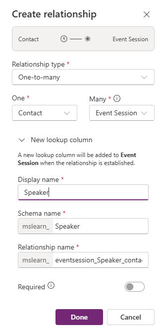

---
lab:
  title: 'التمرين المعملي 2: إنشاء نموذج بيانات'
  learning path: 'Learning Path: Manage the Microsoft Power Platform environment'
  module: 'Module 1: Describe Microsoft Dataverse'
---

## هدف التعلم

في هذا التمرين، سيستخدم المتعلمون Copilot لبناء نموذج بيانات. ستوفر وصفا لنوع الجداول التي تريد إنشاءها واستخدام المصمم لإجراء تغييرات حسب الحاجة مثل إضافة أعمدة إضافية.

عند الانتهاء بنجاح من هذا المختبر، سوف:

- استخدم Copilot لمساعدتك في إنشاء نموذج بيانات.
- إضافة أعمدة إلى الجداول وتحريرها.

### السيناريو

Contoso Consulting هي مؤسسة خدمات مهنية متخصصة في تكنولوجيا المعلومات والخدمات الاستشارية الذكاء الاصطناعي. على مدار العام، يقدمون العديد من الأحداث المختلفة لعملائها. بعض هذه هي التجارة يظهر الأحداث نمط حيث لديهم العديد من الشركاء تأتي في وتقديم تفاصيل عن المنتجات الجديدة، واتجاهات السوق، والخدمات. تحدث الندوات الأخرى على مدار العام وهي ندوات عبر الإنترنت سريعة تستخدم لتوفير تفاصيل حول المنتجات الفردية.

ترغب شركة Contoso في استخدام Power Platform لإنشاء حل إدارة الأحداث الذي يمكنهم استخدامه لإدارة الأحداث المختلفة التي يستضيفونها على مدار العام. بالإضافة إلى ذلك، تتطلع شركة Contoso إلى إنشاء بعض التطبيقات لدعم برنامج التحقق من معدات الموظفين. 

في هذا التمرين، ستقوم بإنشاء وضع بيانات سيتم استخدامه لتخزين الأنواع المختلفة من الأحداث وتسجيلات الأحداث والبيانات الأخرى اللازمة ل Contoso لإدارة أحداثها بشكل فعال. ستقوم أيضا بإنشاء جدول معدات سيتم استخدامه في تطبيقاتهم الأخرى.  

### تفاصيل المختبر

قبل البدء في هذا التمرين، يوصى بإكمال:

- **التمرين المعملي 1 - إنشاء حل**

> **هام:** يستخدم هذا المختبر الذكاء الاصطناعي لبناء المكونات. نظرا لأن الذكاء الاصطناعي النتائج يمكن أن تختلف، فمن المهم ملاحظة أن النتائج قد تكون مختلفة (ولكنها مشابهة) لما تم تعريفه في المختبر. ستكون المفاهيم الأساسية الموضحة في المختبر هي نفسها بغض النظر عما تم إنشاؤه أو اسمه. إذا لم تتطابق الجداول والأعمدة تماما، فقد تحتاج إلى ضبط ما تم إنشاؤه لك.

### توقيت المختبر

الوقت المقدر لإكمال هذا التمرين هو **30 إلى 45** دقيقة.

> **ملاحظة:** في التمرين المعملي السابق، أنشأنا حل إدارة الأحداث وقمنا بتعيينه كحل مفضل في هذه البيئة. لهذا السبب، لا نحتاج إلى الانتقال مباشرة إلى الحل لإنشاء نموذج البيانات الخاص بنا. ستتم إضافة العناصر التي نقوم بإنشائها تلقائيا إلى الحل.

## المهمة 1: إنشاء نموذج بيانات

تخزن شركة Contoso حاليا معلومات جهة اتصال المتبرعين في مثيل Dataverse. إنهم يرغبون في استخدام Dataverse لتتبع المنح التي يقدمون طلبات للحصول عليها والتبرعات التي يتلقونها. تحتاج إلى إنشاء الجداول الضرورية لدعم احتياجات التطبيق المستقبلية ل Contoso.

1.  إذا لزم الأمر، افتح مستعرض ويب وانتقل إلى [مدخل صانع Power Apps](https://make.powerapps.com/) ، وسجل الدخول باستخدام بيانات اعتماد حساب Microsoft.
2.  أثناء وجودك على شاشة Power Pages الرئيسية، باستخدام التنقل على اليسار، حدد **Tables**.
3.  ضمن **Tables**، حدد **Get Started with Copilot**.
4.  في **شاشة وصف الجداول التي تريد أن ينشئها** copilot، أدخل: "*إنشاء جدول لإدارة الأحداث. يجب أن يحدد الجدول اسم الحدث وبيانات الحدث والموقع والحد الأقصى لعدد الحضور وتفاصيل الحدث."*
5.  بجوار **الزر Generate** ، حدد **Table Settings**، وقم بتكوين كما يلي:
    - **خيارات الجدول:** جدول واحد
    - لا **** تقم بتضمين العلاقات.

6.  حدد الزر **إنشاء**.

> **هام:** يجب على Copilot إنشاء **جدول ONE** يسمى الأحداث فقط. إذا تم إنشاء المزيد، فستحتاج إلى **حذفها** عن طريق إخبار Copilot باسم الجدول لحذفه. **سيؤثر الفشل في إزالة أي جداول إضافية على الخطوة التالية.**

**تحرير نموذج البيانات باستخدام Copilot**

الآن بعد أن أنشأنا الجدول، سنقوم بإضافة بعض الأعمدة الإضافية إليه. سنبدأ بإضافة عمود نوع حدث. بالإضافة إلى ذلك، سوف تحضر جهات الاتصال أحداثنا. نريد إضافة جدول جهات الاتصال الموجود إلى نموذج البيانات وإقرانه بتسجيلات الأحداث لاحقا.

7.  في **الحقل What would you like to do nex**t، أدخل: "*Add a choice column named Event Type".*
8.  أضف عمودا آخر بإدخال النص التالي: "*إضافة عمود اختيار يسمى Registration مطلوبة*."

> **هام:** لا يجب أن يتطابق جدول الحدث مع الصورة أعلاه تماما، ولكن يجب أن يحتوي على الأعمدة التالية على الأقل:
- اسم الحدث
- تاريخ الحدث
- الحد الأقصى للحضور
- الموقع
- نوع الحدث
- التسجيل مطلوب.
إذا لم يكن لديك جميع الأعمدة المذكورة أعلاه، فاستخدم Copilot لإضافتها إلى نموذج البيانات.  

بعد ذلك، دعنا نضيف **جدول جهة الاتصال** إلى نموذج البيانات.

9.  في **شريط** الأوامر في الأعلى، حدد **+ جدول موجود.**
10.  في **الحقل بحث**، أدخل **جهة اتصال**، واختر **إضافة محدد.**

اعتمادا على نوع الحدث، قد تكون هناك جلسة واحدة أو أكثر. لإدارة الجلسات المختلفة، نحتاج إلى تحديد ما هي الجلسة والحدث المرتبط بها. بعد ذلك، سنستخدم Copilot لإنشاء جدول جلسات عمل الأحداث.

11.  في **الحقل التالي ما الذي ترغب في القيام به** ، أدخل: "*إضافة جدول جديد يسمى جلسة عمل الحدث".*

من المحتمل أن يقوم Copilot بإنشاء جدولين، جلسة الحدث ومتحدث الحدث. نظرا لأن جهات الاتصال الخاصة بنا ستكون متحدثين، فسوف نقوم بإزالة جدول "المتحدثين بالحدث".

12.  إذا لزم الأمر، في **الحقل التالي ما الذي ترغب في القيام به** ، أدخل: "*إزالة جدول "مكبر صوت الحدث".*
13.  في Copilot، أدخل النص التالي: "*إضافة عمود نص جديد إلى جدول جلسة عمل الحدث المسمى وصف جلسة العمل."*

بعد ذلك، سنقوم بإضافة جدول أخير يسمى تسجيلات الجلسة. سيتم استخدام هذا الجدول لإدارة الأفراد الذين يسجلون في جلسات محددة.

14.  في Copilot، أدخل النص التالي: *"إضافة جدول جديد يسمى تسجيلات الجلسة."*

من المحتمل أن يقوم Copilot بإنشاء جدولين، تسجيل جلسة العمل أو الجلسة أو المشارك (أو شيء آخر). بما أن جهات الاتصال لدينا يمكن أن تكون مشاركين، فسنزيل جدول المشاركين. إذا تم إنشاء أي جداول أخرى (مثل جلسة العمل أو شيء آخر) بخلاف تسجيل الجلسة، فقم بإزالتها.

15.  في Copilot، أدخل النص التالي: "*إزالة جدول المشاركين".*
    
في بعض الأحيان ستتم إضافة عمود اسم المشارك إلى جدول تسجيل الجلسة. نحتاج إلى إزالته لأنه يمكن أن يسبب مشاكل لاحقا عندما نحاول حفظ نموذج البيانات. (سنقوم باستبداله بعمود مشارك مختلف لاحقا.)  

16. إذا لزم الأمر، في Copilot، أدخل النص التالي: "إزالة عمود اسم المشارك من جدول تسجيل الجلسة."

17. إذا كان لديك الآن حقل عمود أساسي، أدخل النص التالي: *إعادة تسمية العمود الأساسي إلى اسم التسجيل.*

18.  في Copilot، أدخل النص التالي: "*إضافة عمود نص إلى جدول تسجيل الجلسة يسمى الإرشادات الخاصة."*

يجب أن يبدو جدول تسجيل الجلسة المكتمل مشابها للصورة أدناه:

> **مهم** على الرغم من أن عمودك لا يحتاج إلى المطابقة تماما، فمن المهم ألا يكون لديك عمود يسمى مشارك، وأن يكون لديك ما يلي على الأقل:
- اسم التسجيل
- تاريخ الجلسة
- إرشادات خاصة

الآن سنقوم بإنشاء علاقات بين جداولنا المختلفة. نظرا لأن سجلات جهات الاتصال يمكن أن تكون متحدثين في جلسات العمل، فسننشئ علاقة بين جدولي جهة الاتصال وجلسة عمل الحدث.

18.  في شريط الأوامر، حدد **إنشاء علاقات**.
19.  تكوين العلاقة كما يلي:
- **نوع العلاقة:** واحد إلى متعدد
- **الأول:** جهة الاتصال
- **كثير:** جلسة عمل الحدث
- **اسم العرض:** السماعة
20.  حدد **تم**.

نظرا لأنه يمكن تسجيل جهات الاتصال للجلسات في الجلسات، سنقوم بإنشاء علاقة بين جدولي جهة الاتصال وتسجيل الجلسة.

21.  في **شريط** الأوامر، حدد **إنشاء علاقات**.
22.  تكوين العلاقة كما يلي:
- **نوع العلاقة:** واحد إلى متعدد
- **الأول:** جهة الاتصال
- **العديد:** تسجيل الجلسة
- **الاسم المعروض:** مشارك

23.  حدد **تم**.

يمكن أن يكون لحدث واحد جلسات متعددة مقترنة به، لذلك سنقوم بإنشاء علاقة بين جدولي Event وEvent Session.

24.  في **شريط** الأوامر، حدد **إنشاء علاقات**.
25.  تكوين العلاقة كما يلي:
- **نوع العلاقة:** واحد إلى متعدد
- **الأول:** حدث
- **كثير:** جلسة عمل الحدث
- **اسم العرض:** الحدث

26. حدد **تم**.

وأخيرا، يقوم المشاركون بالتسجيل في جلسات عمل الأحداث، لذلك سنحتاج إلى إنشاء علاقة بين جداول جلسات الحدث وتسجيلات الجلسة.

27.  في **شريط** الأوامر، حدد **إنشاء علاقات**.
28.  تكوين العلاقة كما يلي:
- **نوع العلاقة:** واحد إلى متعدد
- **الأول:** جلسة عمل الحدث
- **العديد:** تسجيلات الجلسة
- **اسم العرض:** جلسة عمل الحدث

29.  حدد **تم**.

يجب أن يشبه نموذج البيانات الذي تم إنشاؤه حديثا الصورة:

30.  حدد **Save and exit.**

## المهمة 2: تحرير الجداول والأعمدة مباشرة

تعد Copilot طريقة رائعة لإنشاء الجداول والأعمدة بسرعة كبيرة. ومع ذلك، قد تكون هناك أوقات تحتاج فيها إلى إجراء تعديلات على الجداول والأعمدة مباشرة. على سبيل المثال، في هذه المهمة سنقوم بتحديث بعض الأعمدة الموجودة، بالإضافة إلى تعقب عدد المشاركين المسجلين لجلسة معينة.

1.  إذا لزم الأمر، افتح مستعرض ويب وانتقل إلى [مدخل صانع Power Apps](https://make.powerapps.com/) ، وسجل الدخول باستخدام بيانات اعتماد حساب Microsoft.
2.  باستخدام التنقل على اليسار، حدد **الجداول**.
3.  في **حقل البحث** ، أدخل **الحدث**.
4.  افتح **جدول الحدث** .
5.  ضمن **عنوان المخطط** ، حدد **أعمدة**.
6.  حدد موقع عمود نوع** الحدث وافتحه**.
7.  استبدل التسميات بالآتي:
    - مؤتمر
    - المعرض التجاري
    - مؤتمر ويب
    - الغداء والتعلم
    - Launch
8.  **تعيين الخيار** الافتراضي إلى **بلا**.

9.  حدد الزر **حفظ**. (*إذا فشل العمود في الحفظ، في المرة الأولى، حاول مرة أخرى.*)

بعد ذلك، سنضيف عمودا جديدا إلى **جدول Event Session** لتتبع العدد الإجمالي لتسجيلات الجلسة.

10.  باستخدام التنقل على اليسار، حدد **الجداول** لمغادرة **جدول الحدث** .
11.  في **حقل البحث** ، أدخل **الحدث**.
12.  افتح جدول Event **Session** .
13.  ضمن **عنوان المخطط** ، حدد **أعمدة**.
14.  في شريط الأوامر، حدد **الزر عمود** جديد.
15.  تكوين العمود الجديد كما يلي:
    - **اسم العرض:** إجمالي التسجيلات
    - **نوع البيانات:** العدد الكامل
    - **السلوك**: مجموعة التحديثات

16.  حدد **حفظ وتحرير**.

> **هام:** إذا كان حظر العناصر المنبثقة قيد التشغيل، فقد تحتاج إلى إيقاف تشغيله حتى يتم عرض حقل الطرح.

17.  تكوين عمود مجموعة التحديثات كما يلي:
- ضمن **الوحدة ذات الصلة**، حدد **إضافة كيان** ذي صلة.
- اختر جدول تسجيل** الجلسة**.
- **حدد الزر حفظ التغييرات** (*علامة الاختيار*)
- ضمن **التجميع**، حدد **إضافة تجميع**.
- ضمن **الدالة التجميعية**، اختر **Count**.
- بالنسبة **لحقل "Aggregated Related Entity** "، حدد **"Session Registration**".
- **حدد الزر *حفظ التغييرات** (علامة الاختيار)*

18.  **حدد الزر حفظ وإغلاق**.

لقد نجحت الآن في إنشاء نموذج البيانات الذي سيتم استخدامه لدعم تطبيق إدارة الأحداث. 

## المهمة 3: إنشاء جدول معدات

بالإضافة إلى إدارة الأحداث، لدى شركة Contoso برنامج سحب الموظفين.  بعد ذلك، سنقوم بإنشاء الجدول لتخزين المعدات. 
1.  باستخدام التنقل على اليسار، حدد **الجداول**.
2.  ضمن **Tables**، حدد **Get Started with Copilot.**
3.  في **شاشة وصف الجداول التي تريد أن ينشئها** Copilot، أدخل: *"إنشاء جدول للتحقق من المعدات. يجب أن يتضمن الجدول اسم الجهاز وتاريخ الاستحقاق ورقم العنصر."*
4.  بجوار **الزر Generate** ، حدد **Table Settings**، وقم بتكوين كما يلي:
- **خيارات الجدول:** جدول واحد
- لا **** تقم بتضمين العلاقات.

5. حدد الزر **إنشاء**.

> **هام:** يجب على Copilot إنشاء جدول واحد فقط يسمى **Checkout Equipment**. إذا تم إنشاء المزيد، يمكنك حذفها، عن طريق إخبار Copilot باسم الجدول لحذفه.

**تحرير نموذج البيانات باستخدام Copilot**

الآن بعد أن أنشأنا الجدول، سنقوم بإضافة بعض الأعمدة الإضافية إليه. سنبدأ بإضافة عمود نوع حدث. بالإضافة إلى ذلك، سوف تحضر جهات الاتصال أحداثنا. نريد إضافة جدول جهات الاتصال الموجود إلى نموذج البيانات وإقرانه بتسجيلات الأحداث لاحقا.
6.  في **الحقل التالي What you like to do to do** ، أدخل: *"Rename table to Equipment."*
7.  في **الحقل التالي What you like to do to do** ، أدخل: *"Add a choice column named Equipment type."*
8.  أضف عمودا آخر بإدخال النص التالي: *"إضافة عمود نص يسمى الفئة. "*
9.  أضف عمودا آخر بإدخال النص التالي: *"إضافة عمود نص يسمى الحالة."*

يجب أن يشبه الجدول المكتمل الصورة أدناه:

10. إذا كان الجدول يتضمن أعمدة إضافية، فقم بإزالة هذه الأعمدة بإدخال *"حذف العمود [اسم العمود]."*
11. بمجرد تطابق الجدول مع الصورة، حدد **Save and exit**.

## المهمة 4: تعديل جدول المعدات مباشرة

1.  إذا لزم الأمر، افتح مستعرض ويب وانتقل إلى مدخل صانع Power Apps، وسجل الدخول باستخدام بيانات اعتماد حساب Microsoft.
2.  باستخدام التنقل على اليسار، حدد **الجداول**.
3.  في **حقل البحث** ، أدخل **المعدات.**
4.  افتح **جدول المعدات** .
5.  ضمن **عنوان المخطط** ، حدد **أعمدة.**
6.  حدد موقع عمود نوع** المعدات وافتحه**.
7.  إذا لزم الأمر، استبدل Labels بالآتي:
- الإلكترونيات
- الأثاث
- الأدوات
- مُكَمِّلات
8.  **تعيين الخيار** الافتراضي إلى **بلا.**

9.  حدد زر الحفظ. (إذا فشل العمود في الحفظ، في المرة الأولى، حاول مرة أخرى.)

تهانينا، لقد نجحت في إنشاء نموذج بيانات في Microsoft Dataverse.

