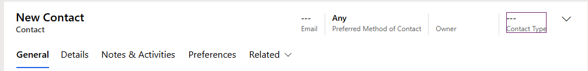
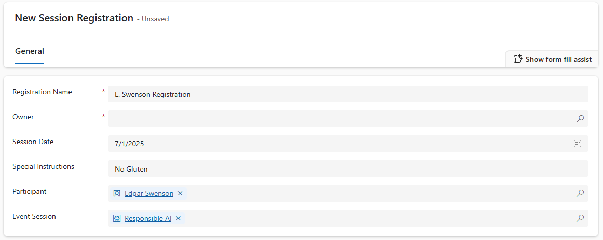

---
lab:
  title: 'التمرين المعملي 5: إنشاء تطبيق يستند إلى النموذج'
  learning path: 'Learning Path: Demonstrate the capabilities of Microsoft Power Apps'
  module: 'Module 3: Build a model-driven app'
---
## هدف التعلم

في هذا التمرين، سيقوم المتعلمون بإنشاء تطبيق يستند إلى نموذج في Power Apps باستخدام Copilot. ستقوم بتعريف نموذج البيانات وتعديل النماذج وطرق العرض وإنشاء التطبيق.

**عند الانتهاء بنجاح من هذا المختبر، سوف:**

-   إنشاء تطبيق يستند إلى نموذج.
-   تعديل النماذج وطرق العرض في التطبيق لتناسب احتياجاتك على أفضل نحو.
-   التنقل عبر تطبيق يستند إلى نموذج.

### السيناريو

Contoso Consulting هي مؤسسة خدمات مهنية متخصصة في تكنولوجيا المعلومات والخدمات الاستشارية الذكاء الاصطناعي. على مدار العام، يقدمون العديد من الأحداث المختلفة لعملائها. بعض هذه هي التجارة يظهر الأحداث نمط حيث لديهم العديد من الشركاء تأتي في وتقديم تفاصيل عن المنتجات الجديدة، واتجاهات السوق، والخدمات. تحدث الندوات الأخرى على مدار العام وهي ندوات عبر الإنترنت سريعة تستخدم لتوفير تفاصيل حول المنتجات الفردية.

ترغب شركة Contoso في استخدام Power Platform لإنشاء حل إدارة الأحداث الذي يمكنهم استخدامه لإدارة الأحداث المختلفة التي يستضيفونها على مدار العام.

في هذا التمرين، ستقوم بإنشاء تطبيق يستند إلى نموذج لإدارة أحداث Contoso. سيستند التطبيق المستند إلى النموذج إلى نموذج بيانات موجود وسيتضمن الأحداث وجلسات الأحداث وتسجيلات الجلسة.

### تفاصيل المختبر:

قبل البدء في هذا التمرين، يوصى بإكمال:

-   **التمرين المعملي 1 - إنشاء حل**
-   **التمرين المعملي 2 - إنشاء نموذج بيانات**

الوقت المقدر لإكمال هذا التمرين هو **20 إلى 30** دقيقة.

## المهمة 1: إنشاء نموذج بيانات لدعم تطبيقك الجديد المستند إلى النموذج

تقوم شركة Contoso حاليا بتخزين معلومات الاتصال في مثيل Dataverse، لذلك يرغبون في استخدام Dataverse لتتبع الدورات التدريبية وتسجيلات الدورة التدريبية. تحتاج إلى إنشاء الجداول الضرورية لدعم التطبيق وإنشاء تطبيق يستند إلى نموذج استنادا إلى نموذج البيانات هذا.

1.  إذا لزم الأمر، افتح مستعرض ويب وانتقل إلى [مدخل صانع Power Apps](https://make.powerapps.com/) ، وسجل الدخول باستخدام بيانات اعتماد حساب Microsoft.
2.  باستخدام التنقل على اليسار، حدد **الحلول.**
3.  افتح **حل إدارة** الأحداث الذي قمت بإنشائه سابقا.
4.  في **شريط الأوامر، حدد **تطبيق جديد **\>** يستند إلى نموذج التطبيق.**** \> ****
5.  **حدد قسم Create**.
    -   **الاسم:** إدارة أحداث Contoso
    -   **الوصف:** يستخدم لإدارة الأحداث وجلسات عمل الأحداث.
6.  **حدد الزر** إنشاء**.**
7.  **حدد الزر إضافة صفحة**، وحدد **جدول Dataverse.**
8.  حدد الجداول التالية:
    -   جهة اتصال
    -   الحدث
    -   جلسة عمل الحدث
    -   تسجيل الجلسة
9.  تأكد من **تحديد إظهار في التنقل** .

10. حدد الزر **إضافة**.

> **ملاحظة:** في بعض الأحيان ستتم مطالبتك بتسجيل الدخول أثناء العمل مع المصمم. حدد X لإلغاء الخروج من شاشة تسجيل الدخول.

## المهمة 2: تحرير التطبيق المستند إلى النموذج ليناسب احتياجاتك

الآن بعد إنشاء التطبيق، سنقوم بإجراء بعض التغييرات على طريقة تقديم التطبيق. نريد أن يكون لدينا مجموعتين متميزتين؛ الأشخاص والأحداث. نريد أن يكون جدول جهات الاتصال في مجموعة الأشخاص، وجميع جداول الأحداث في مجموعة الأحداث.

1.  ضمن **التنقل** على الجانب الأيمن من الشاشة، حدد **مجموعة** جديدة.
2.  على الجانب الأيسر من التطبيق، قم بتوسيع لوحة Properties****.
3.  **تغيير العنوان** من **مجموعة** جديدة إلى **أشخاص.**

    

4.  حدد علامة **القطع** في **مجموعة الأشخاص** .
5.  اختر **مجموعة** جديدة.
6.  في جزء Properties****، قم بتغيير اسم المجموعة من **New Group** إلى **Events.**
7.  مرر مؤشر الماوس فوق **طريقة عرض** تسجيلات الجلسة على اليسار، وحدد علامة الحذف****، واختر **تحريك لأسفل** لنقل **تسجيلات الجلسات** إلى **مجموعة الأحداث**.
8.  مرر مؤشر الماوس فوق **طريقة عرض جلسات** الأحداث على اليسار، وحدد علامة الحذف****، واختر **تحريك لأسفل** لنقل **جلسات** عمل الأحداث إلى **مجموعة الأحداث**.
9.  مرر مؤشر الماوس فوق **طريقة عرض** الأحداث على اليسار، وحدد علامة الحذف****، واختر **تحريك لأسفل** لنقل **الأحداث** إلى **مجموعة** الأحداث.

يجب أن يشبه تطبيقك الصورة:

## المهمة 3: تحرير النماذج وطرق العرض المختلفة في التطبيق المستند إلى النموذج

يستخدم تطبيق محرك الأقراص النموذجي النماذج وطرق العرض لتقديم البيانات للمستخدمين في واجهة المستخدم (UI). سنقوم بإجراء بعض التغييرات على هذه العناصر.

1.  إذا لزم الأمر، فتأكد من **فتح تطبيق Contoso Event Management** في المصمم.
2.  على الجانب الأيمن من الشاشة، ضمن **مجموعة الأشخاص** ، مرر مؤشر الماوس فوق **نموذج** جهات الاتصال وحدد **تحرير.**

    إذا تمت مطالبتك بحفظ التغييرات، فحدد **حفظ ومتابعة.**

3.  ضمن **أعمدة** الجدول على اليسار، حدد **عمود** جدول جديد.
4.  تكوين عمود الجدول كما يلي:
    -   **اسم العرض:** نوع جهة الاتصال
    -   **نوع البيانات:** الاختيار
    -   **المزامنة مع الاختيار العمومي:** لا
5.  قم بتعيين Label **** من الاختيار الأول إلى **Speaker.**
6.  حدد **+ خيار جديد** وقم بتعيين التسمية إلى **مشارك.**
7.  حدد **+ New Choice** ثم قم بتعيين التسمية إلى **فريق عمل** الدعم.

8.  حدد الزر **حفظ**.
9.  باستخدام الماوس، حدد **نص جهة الاتصال** الجديدة لتحديد رأس النموذج. *(يجب أن يظهر مستطيل أرجواني حول الرأس)*
10. ضمن **أعمدة** الجدول، في **حقل البحث** ، أدخل **جهة الاتصال**.
11. حدد عمود جدول نوع** جهة الاتصال الذي **أنشأته للتو.
12. **يجب أن يظهر "نوع** جهة الاتصال" الآن في **العنوان**.

13. في شريط أوامر النماذج **، حدد **الزر حفظ ونشر**.**
14. حدد زر السهم **** للخلف للعودة إلى مصمم التطبيق المستند إلى النموذج
15. ضمن **التنقل** على اليسار، مرر مؤشر الماوس فوق **طريقة عرض** جهات الاتصال، وحدد الأيقونة **تحرير** . (إذا طلب منك الحفظ، فحدد **حفظ ومتابعة.**)
16. حدد **+ View Column**.
17. ابحث عن العمود نوع** جهة الاتصال وأضفه **إلى طريقة العرض.
18. حدد الزر **حفظ ونشر**.
19. حدد زر السهم **** للخلف للعودة إلى مصمم التطبيق المستند إلى النموذج.

بعد ذلك، سنقوم بإجراء التغييرات اللازمة على النماذج المتبقية.

20.  ضمن **التنقل**، حدد **طريقة عرض الأحداث**
    
لاحظ أنه قد يكون **هناك عمود EventDetails1** . إذا كان الأمر كذلك، فسنزيله من طريقة العرض. *(إذا لم يكن لديك، يمكنك التخطي إلى **المهمة 4: حفظ ونشر**)*

21.  مرر مؤشر الماوس فوق **طريقة عرض** الأحداث وحدد **الزر تحرير** .

إذا تمت مطالبتك بحفظ **** التغييرات، فحدد **حفظ ومتابعة**.

22.  في **طريقة العرض** حدد السهم الموجود بجانب **EventDetails1**، ومن القائمة التي تظهر، حدد **إزالة**.

23.  حدد الزر **حفظ ونشر**.
24.  حدد زر السهم **** للخلف للعودة إلى مصمم التطبيق.
25.  ضمن **التنقل**، مرر مؤشر الماوس فوق **نموذج** الأحداث** **وحدد **تحرير**.

إذا تمت مطالبتك بحفظ التغييرات، فحدد **حفظ ومتابعة**.

26.  حدد **حقل تفاصيل الحدث1** واضغط على **المفتاح Delete** على لوحة المفاتيح.

يجب أن يشبه النموذج الصورة:

إذا لم يتطابق تماما، فهذا جيد طالما أن جميع الحقول في الصورة موجودة هناك.  

27.  **حدد الزر حفظ ونشر**.
28.  حدد زر السهم **** للخلف للعودة إلى مصمم التطبيق.

## المهمة 4: حفظ ونشر (إذا لم يكن لديك الحقل EventDetail1 في النموذج، فتابع هنا.)

1.  في **شريط الأوامر** للتطبيق، حدد **الزر حفظ ونشر** .
2.  **حدد الزر رجوع** للعودة إلى **حل إدارة** الأحداث.
3.  حدد **سهم الرجوع إلى الحلول** للعودة إلى مدخل صانع Power Apps** الرئيسي**.
4.  حدد السهم **رجوع** للعودة إلى شاشة Power Apps** الرئيسية**.

## المهمة 5: اختبار التطبيق الجديد

الآن بعد إنشاء تطبيقك المستند إلى النموذج، سنختبر وظائفه.

أولا سنقوم بإضافة اثنين من جهات الاتصال.

1.  باستخدام التنقل على اليسار، حدد **التطبيقات**.
2.  غير التطبيقات التي يتم عرضها من **تطبيقاتي** إلى **الكل**.
3.  مرر مؤشر الماوس فوق **تطبيق Event Management** الذي أنشأته للتو وحدد أيقونة **Play** .
4.  باستخدام التنقل على اليسار، حدد **جهات الاتصال**.
5.  في **شريط الأوامر** ، حدد **الزر + جديد** .
6.  في **شاشة جهة الاتصال** الجديدة، قم بتكوين كما يلي:
    -   **الاسم الأول:** سوزان
    -   **اسم العائلة:** دياز.
    -   **المسمى الوظيفي:** مهندس
7.  في رأس النموذج، حدد السهم لأسفل بجوار **نوع** جهة الاتصال.
8.  **تعيين نوع** جهة الاتصال إلى **مكبر الصوت**.

9.  **حدد الزر حفظ** لحفظ جهة الاتصال واتركها مفتوحة.
10. **حدد الزر + New**.
11. في **شاشة جهة الاتصال** الجديدة، قم بتكوين كما يلي:
    -   **الاسم الأول:** Edgar
    -   **اسم العائلة:** Swenson
    -   **المسمى الوظيفي:** مهندس معماري
    -   **البريد الإلكتروني:** أدخل عنوان بريدك الإلكتروني (تأكد من إضافة **عنوان بريدك** الإلكتروني.)
12. في رأس النموذج، حدد السهم لأسفل بجوار **نوع** جهة الاتصال.
13. **تعيين نوع** جهة الاتصال إلى **مشارك**.
14. حدد الزر **حفظ وإغلاق**.

بعد ذلك، سنضيف حدثا جديدا.

15.  باستخدام التنقل على اليسار، حدد **الأحداث**.
16.  في شريط الأوامر، حدد **الزر + جديد** .
17.  في **شاشة حدث** جديد، قم بتكوين كما يلي:
- **اسم الحدث:** مؤتمر Spring.
- **تاريخ الحدث:** تاريخ الغد.
- **الحد الأقصى للحضور:** 500
- **تفاصيل الحدث:** مؤتمر Spring لعرض أحدث المنتجات والخدمات من موردينا المدعومين.
- **نوع الحدث:** مؤتمر
- **الموقع:** سياتل
- **التسجيل مطلوب:** نعم/صحيح

18.  حدد الزر **حفظ وإغلاق**.

بعد ذلك، سنضيف جلسة عمل جديدة للحدث.

19.  باستخدام التنقل على اليسار، حدد **جلسات عمل الأحداث**.
20.  **حدد الزر + New**.
21.  تكوين **جلسة** عمل الحدث كما يلي:
- **اسم الجلسة:** الذكاء الاصطناعي المسؤول
- **تاريخ الجلسة:** تاريخ الغد
- **المدة:** 1.5 ساعة
- **وصف الجلسة:** مع جميع حلول الذكاء الاصطناعي الجديدة، من المهم أن تكون مسؤولا. وسنناقش التحديات.
- **المتحدث:** سوزان دياز
- **الحدث:** مؤتمر الربيع

22.  **حدد الزر حفظ وإغلاق**.

وأخيرا، سنقوم بإنشاء **تسجيل** جلسة عمل.

23.  باستخدام التنقل على اليسار، حدد **تسجيلات الجلسة.**
24.  في **شريط** الأوامر، حدد **+ جديد**.
25.  أكمل تسجيل الجلسة كما يلي:
- **اسم التسجيل:** E، Swenson Registration.
- **المالك:** اتركه كما هو
- **تاريخ التسجيل:** تاريخ اليوم
- **تعليمات خاصة:** لا توجد غلوتين
- **المشارك:** Edgar Swenson
- **جلسة عمل الحدث:** الذكاء الاصطناعي مسؤول

26.  حدد الزر **حفظ وإغلاق**.
