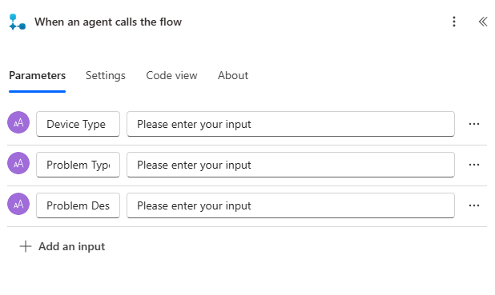

---
lab:
  title: 'التمرين المعملي 6: إنشاء تدفق Power Automate'
  learning path: 'Learning Path: Demonstrate the capabilities of Microsoft Power Automate'
  module: 'Module 2: Build a Microsoft Power Automate flow'
---
## هدف التعلم

في هذا التمرين، سيقوم المتعلمون بإنشاء سلسلة من تدفقات السحابة المختلفة باستخدام Microsoft Copilot في Power Automate. سوف تستخدم أساليب إنشاء مختلفة مثل Copilot ومن الصفر لتصبح على دراية بالخيارات المختلفة المتاحة.

**عند الانتهاء بنجاح من هذا التمرين، سوف:**

- استخدام مطالبات اللغة الطبيعية لتصميم مهام سير العمل
- تكوين المشغلات والإجراءات
- اختبار الأتمتة للاستخدام العملي.

### السيناريو

Contoso Consulting هي مؤسسة خدمات مهنية متخصصة في تكنولوجيا المعلومات والخدمات الاستشارية الذكاء الاصطناعي. على مدار العام، يقدمون العديد من الأحداث المختلفة لعملائها. بعض هذه هي التجارة يظهر الأحداث نمط حيث لديهم العديد من الشركاء تأتي في وتقديم تفاصيل عن المنتجات الجديدة، واتجاهات السوق، والخدمات. تحدث الندوات الأخرى على مدار العام وهي ندوات عبر الإنترنت سريعة تستخدم لتوفير تفاصيل حول المنتجات الفردية. بالإضافة إلى ذلك، بدأت Contoso في استخدام العوامل التلقائية لمساعدة العملاء في الأسئلة.

ترغب شركة Contoso في استخدام Power Automate لإنشاء تدفق تأكيد التسجيل الذي سيرسل بريدا إلكترونيا تلقائيا إلى عميل عند التسجيل في حدث. بالإضافة إلى ذلك، يريدون إنشاء تدفق يستخدم الذكاء الاصطناعي لتوفير إجابات إنشاءية لأسئلة العملاء.

في هذا التمرين، ستقوم بإنشاء سلسلة من تدفقات Power Automate استنادا إلى معايير محددة.

قبل البدء في هذا التمرين، يجب أن تكون قد أكملت التمرين المعملي التالي:

- **التمرين المعملي 3 - إنشاء نموذج بيانات**
- **التمرين المعملي 5 - إنشاء تطبيق يستند إلى النموذج**

## التمرين 1: إنشاء تدفق إعلام تسجيل الجلسة

في هذا التمرين الأول، ستقوم بإنشاء تدفق سيتم تشغيله تلقائيا عند إنشاء تسجيل جلسة عمل جديد. وسوف تحصل على تفاصيل الجلسة والحدث والاتصال الذي قام بالتسجيل وإرسال بريد إلكتروني إلى هذا مع تفاصيل التسجيل الخاصة بهم.

### المهمة 1: إنشاء تدفق

نريد إرسال تأكيد تسجيل إلى أي مستخدمين مسجلين حديثا. سننشئ تدفقا يلتقط تفاصيل التسجيل ويرسل رسالة بريد إلكتروني للتأكيد إلى المستخدم المسجل.

1.  الانتقال إلى <https://make.powerautomate.com>.
2.  قد تحتاج إلى إعادة المصادقة، حدد **تسجيل الدخول** واتبع التعليمات إذا لزم الأمر.
3.  في شاشة Create you automation with Copilot، أدخل: *"عند إنشاء تسجيل جلسة عمل جديد في Dataverse، احصل على تفاصيل الجلسة والحدث الذي يكون فيه التسجيل لإرسال رسالة بريد إلكتروني للتأكيد إلى الشخص المسجل."*
4.  سيقترح Copilot تدفقا محتملا بناء على وصفك.
5.  يتعين أن تبدو الصورة كما يلي:

6.  حدد **الاحتفاظ به والمتابعة**.
7.  راجع الاتصالات للتأكد من صحة كل شيء.
8.  حدد إنشاء التدفق.
9.  اختر المشغل **عند إضافة صف أو تعديله أو حذفه**.
10. بادر بملء شروط المشغل للتدفق:
    - حدد **تمت الإضافة** في **نوع التغيير**
    - حدد **Session Registrations** لاسم **الجدول**
    - حدد **المنظمة** في **النطاق**
11. حدد النص **عند إضافة صف أو تعديله أو حذفه** وإعادة تسمية خطوة **المشغل عند إضافة تقرير مصروفات.**

هذه ممارسة جيدة، لذا يمكنك أنت ومحررو التدفق الآخرون فهم الغرض من الخطوة دون الحاجة إلى الخوض في التفاصيل.

### المهمة 2: إنشاء خطوة للحصول على تفاصيل جلسة الحدث التي يتم التسجيل من أجلها.

1.  حدد **Get a row by ID** step.
2.  تحديد **جلسات الأحداث** كاسم **جدول**
3.  حدد الحقل **معرف الصف**. لاحظ وجود نافذة منبثقة لتحديد **المحتوى الديناميكي** أو **التعبيرات**.
4.  في **الحقل معرف** الصف، حدد **جلسة عمل الحدث (القيمة)** من **قائمة المحتوى** الديناميكي.
5.  **حدد النص Get a row by ID**، ثم أعد تسمية هذا الإجراء **Get** **Event Session**.

بعد ذلك، سنحصل على تفاصيل الحدث الذي توجد فيه الجلسة.

6.  حدد **Get a row by ID 2** step.
7.  تحديد **الأحداث** كاسم **جدول**
8.  حدد الحقل **معرف الصف**. لاحظ وجود نافذة منبثقة لتحديد **المحتوى الديناميكي** أو **التعبيرات**.
9.  في **الحقل معرف** الصف، حدد **الحدث (القيمة)** من **قائمة المحتوى** الديناميكي.
10.  **حدد النص Get a row by ID**، ثم أعد تسمية هذا الإجراء **Get** **Event**.

وأخيرا، سنحصل على تفاصيل الشخص المسجل للجلسة.

11.  ضمن Get Event Details، حدد Insert **new Action**.
12.  في حقل البحث، أدخل Dataverse.
13.  حدد **الحصول على صف حسب المعرف**.
14.  حدد **جهات الاتصال** في **اسم الجدول**
15.  حدد الحقل **معرف الصف**. لاحظ وجود نافذة منبثقة لتحديد **المحتوى الديناميكي** أو **التعبيرات**.
16.  في **الحقل معرف** الصف، حدد **مشارك (قيمة)** من **قائمة المحتوى** الديناميكي.
17.  **حدد النص الحصول على صف حسب المعرف**، ثم أعد تسمية هذا الإجراء **الحصول على** **تفاصيل** المشارك.

### المهمة 3: إنشاء خطوة لإرسال بريد إلكتروني لتأكيد تسجيل الجلسة

1.  **حدد خطوة** إرسال البريد الإلكتروني.
2.  حدد أيقونة **الترس** أعلى **الحقل إلى** وحدد **استخدام** **القيم الديناميكية**.
3.  **حدد الحقل إلى** واستخدام القيم الديناميكية، وحدد **البريد الإلكتروني** ضمن **الحصول على تفاصيل** المشارك.
4.  في **حقل الموضوع** ، تأكد من أنه يقول تأكيد التسجيل.
5.  أدخل النص التالي في **نص البريد الإلكتروني**:

> [!NOTE]
> يتعين وضع المحتوى الديناميكي حيث تتم تسمية الحقول بين قوسين. يوصى بنسخ كل النص ولصقه أولاً ثم إضافة المحتوى الديناميكي في الأماكن الصحيحة.

*عزيزي {First Name}، شكرا للتسجيل في جلسة العمل القادمة {Session Name} في {Event Date}. سيكون المتحدث {Value} هو المتحدث في جلسة العمل هذه. من المقرر أن تستمر جلسة العمل {Duration (Hours)}. تحقق من جلسة العمل الأخرى في {Event Name}.*

*مع خالص تحياتي*

*إدارة الأحداث*

*Contoso Consulting*

6.  بادر بتمييز النص **{First Name}**. استبدله **بالحقل First Name** من **الخطوة Get Participant Details** .
7.  قم بتمييز **النص {Session Name}** . استبدله بالحقل **"اسم** جلسة العمل" **من خطوة الحصول على جلسة** عمل الحدث.
8.  قم بتمييز **النص {Event Date}** . استبدله بالحقل **"تاريخ** الحدث" **من الخطوة "الحصول على تفاصيل** الحدث".
9.  قم بتمييز **النص {Duration (Hours)}** . استبدله بالحقل **Duration (Hours)** من **خطوة Get Event Session** .
10.  قم بتمييز **النص {Event Name}** . استبدله بالحقل **Event Name** من **الخطوة Get Event Details** .

يجب أن تشبه خطوتك المكتملة الصورة:

11.  حدد **حفظ**.

اترك علامة تبويب التدفق مفتوحة من أجل المهمة التالية. يجب أن يبدو التدفق على النحو التالي:

### المهمة  4: التحقق من التدفق واختباره

1.  افتح علامة تبويب جديدة في متصفحك وانتقل إلى https://make.powerapps.com.
2.  حدد بيئة **Dev One** في الجزء العلوي الأيمن إذا لم تكن محددة بالفعل.
3.  حدد **التطبيقات** وافتح **تطبيق** إدارة الأحداث Contoso.
4.  اترك علامة تبويب المستعرض مفتوحة، وانتقل مرة أخرى إلى علامة التبويب السابقة التي بها تدفقك.
5.  على شريط الأوامر، حدد **اختبار**. حدد **يدوياً**، ثم حدد **اختبار**.
6.  انتقل إلى علامة تبويب المستعرض باستخدام التطبيق المستند إلى النموذج.
7.  باستخدام التنقل في خريطة الموقع على اليسار، حدد **تسجيل** الجلسة.
8.  **حدد الزر + New** لإضافة سجل تسجيل** جلسة عمل جديد**.
9.  أكمل سجل** تسجيل الجلسة **كما يلي:
    -   **اسم التقرير:** تقرير الاختبار
    -   **الغرض من التقرير:** مؤتمر
    -   **تاريخ استحقاق التقرير:** غدا
10. حدد الزر **حفظ وإغلاق**.
11. انتقل إلى علامة تبويب المتصفح حيث يتم تشغيل اختبار التدفق. بعد لحظات تأخير، يجب أن ترى التدفق قيد التشغيل. تستطيع من هذا المكان تحديد أي مشكلات في التدفق أو التأكد أمن نجاح التشغيل.

بعد تأخير قصير، يجب أن تشاهد رسالة بريد إلكتروني في علبة الوارد.

> [!NOTE]
> قد ينتقل إلى مجلد البريد الإلكتروني غير الهام.

## التمرين 2: إنشاء تدفق استكشاف أخطاء التكنولوجيا وإصلاحها

### المهمة 1: إنشاء تدفق استكشاف أخطاء التكنولوجيا وإصلاحها

في هذا التمرين، ستقوم بإنشاء تدفق Power Automate الذي سيتم تشغيله كعامل سيلتقط الأعراض ويستخدمه لتشخيص مشكلة التكنولوجيا.

1.  افتح [**Power Automate**](https://make.powerautomate.com)**.**
2.  باستخدام التنقل على اليسار، حدد **إنشاء**.
3.  حدد **تدفق السحابة التلقائي.**
4.  **حدد الزر تخطي**.
5.  **حدد مربع إضافة مشغل**. ابحث عن وحدد **When an agent calls the flow**.
6.  حدد **إضافة إدخال**.
7.  حدد **نص** وغير الاسم من **إدخال** إلى **نوع** الجهاز.
8.  حدد **إضافة إدخال** مرة أخرى، واختر **نص**، وغير الاسم من **إدخال** إلى **نوع** المشكلة.
9.  حدد **إضافة إدخال** مرة أخيرة، واختر **نص**، وغير الاسم من **إدخال** إلى **وصف المشكلة.**

يجب أن يشبه المشغل المكتمل الصورة التالية:

> [!IMPORTANT]
> إذا كنا ننشئ مدققا صحيحا للأعراض التقنية، فسنلتقط مدخلات مختلفة متعددة لمساعدة الإجابات التي تم إنشاؤها لتكون دقيقة قدر الإمكان. لهذا التمرين، نحن نوضح فقط كيف يمكنك القيام بذلك.

#### تحديد إجراء

1.  **ضمن عندما يستدعي عامل مشغل التدفق**، حدد **إدراج خطوة** جديدة (+).
2.  في نافذة إضافة إجراء، ابحث عن، وحدد **تشغيل مطالبة**.
3.  في **نافذة Run a prompt** ، قم بتعيين **الحقل Prompt** إلى **الذكاء الاصطناعي Summarize**.
4.  في **حقل Input Text**، حدد أيقونة **Dynamics value** *(Lightning bolt).*
5.  ضمن عندما يستدعي عامل التدفق، حدد القيم الديناميكية التالية:
    -   نوع الجهاز
    -   نوع المشكلة
    -   وصف المشكلة
6.  **ضمن الخطوة تشغيل مطالبة**، حدد **إدراج خطوة جديدة (+)**
7.  في **نافذة Add an action** ، أدخل "Respond"، وحدد **Respond to the agent**.
8.  حدد **Add an output**.
9.  حدد **نص**.
10. تعيين اسم الإخراج إلى **نص** ملخص.
11. في **الحقل Enter a value to respond with** ، حدد **Dynamic value** (Lighting bolt)
12. ابحث عن **‏‫النص الأساسي**وحدده.

يجب أن تشبه خطوة الاستجابة إلى العامل** المكتملة **ما يلي:

13.  حدد **حفظ**.
14.  حدد الزر **Test**.
15.  في جزء test **Flow** ، حدد **Manually**.
16.  حدد الزر **Test**.
17.  في جزء Run Flow، أدخل ما يلي:
    - **نوع الجهاز:** كمبيوتر Windows
    - **نوع المشكلة:** تطبيق غير مستجيب
    - **وصف المشكلة:** عند تشغيل Microsoft Excel، سيبدأ تحميل التطبيق ولكن سيتم تجميده بعد شاشة Excel Splash. هو فقط يجلس هناك ولا شيء يحدث.
18.  **حدد الزر Run flow**.
19.  بمجرد اكتمال الاختبار، حدد خطوة Run a Prompt. لاحظ أن التبديل مرة أخرى إلى **علامة التبويب Designer** .
20.  حدد **نشر**.
