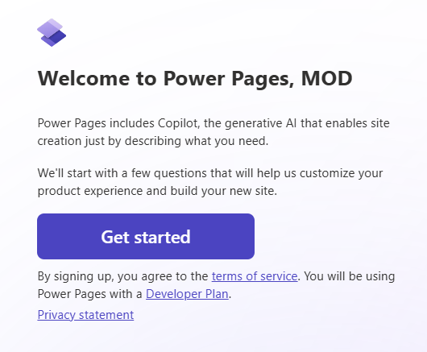

---
lab:
  title: 'التمرين المعملي 6: إنشاء موقع Power Pages'
  learning path: 'Learning Path: Demonstrate the capabilities of Microsoft Power Pages'
  module: 'Module 2: Create a Microsoft Power Pages site'
---
## هدف التعلم

في هذا التمرين، سيستخدم المتعلمون Copilot لإنشاء موقع Power Pages. بمجرد إنشاء الموقع، ستستخدم Power Pages Design Studio لتنفيذ مهام مثل إضافة المحتوى وتعديله، بالإضافة إلى تغيير النسق.

### السيناريو

على مدار العام، تستضيف شركة Contoso Consulting العديد من أنواع الأحداث المختلفة. وهي تتراوح من الأحداث الشخصية، إلى الندوات عبر الإنترنت، والتدريبات بقيادة المدرب والمزيد. إنهم يتطلعون إلى استخدام Microsoft Power Platform لإدارة الأحداث المختلفة التي يضعونها. يريدون استخدام Power Pages لإنشاء موقع إدارة أحداث يعرض الأحداث المختلفة التي يستضيفونها.

عند الانتهاء بنجاح من هذا التمرين، سوف:

-   استخدم Copilot لإنشاء موقع ويب لإدارة الأحداث.
-   إضافة محتوى جديد إلى موقعك.
-   معاينة موقع Power Pages الجديد الخاص بك من أنواع مختلفة من الأجهزة.

**تفاصيل المختبر:**

قبل البدء في هذا التمرين، يجب أن تكون قد أكملت التمرين المعملي التالي:

- **التمرين المعملي 2 - إنشاء نموذج بيانات**

> **هام:** يستخدم هذا المختبر الذكاء الاصطناعي لبناء المكونات. نظرا لأن الذكاء الاصطناعي النتائج يمكن أن تختلف، فمن المهم ملاحظة أن نتائجك قد تكون مختلفة (ولكنها مشابهة) لما تم تعريفه في المختبر. ستكون المفاهيم الأساسية الموضحة في المختبر هي نفسها بغض النظر عما تم إنشاؤه أو اسمه. إذا لم تتطابق الجداول والأعمدة تماما، فقد تحتاج إلى ضبط ما تم إنشاؤه لك.

الوقت المقدر لإكمال هذا التمرين هو **30 إلى 45** دقيقة.

**قبل البدء:** إذا كانت هذه هي المرة الأولى التي تقوم فيها بالوصول إلى مدخل صانع Power Pages، فقد تحتاج إلى التشغيل من خلال بعض الإعدادات.  إذا كان الأمر كذلك، فاتبع الإرشادات أدناه.  وإلا، يمكنك المتابعة إلى **المهمة 1.**  

1.  إذا لزم الأمر، انتقل إلى [Microsoft Power Pages](https://make.powerpages.microsoft.com).
1.  في **شاشة مرحبا بك في Power Pages** ، حدد **زر بدء الاستخدام** .

    

1. في **شاشة أخبرنا قليلا عن نفسك** ، حدد **الزر تخطي** .

    

## المهمة 1: استخدم Copilot لإنشاء موقع صفحات Power جديد.

1.  إذا لزم الأمر، فانتقل إلى <https://make.powerpages.microsoft.com>
1.  في **الصفحة الرئيسية لتصميم استوديو** Power Pages، أدخل النص التالي: "*إنشاء موقع لإدارة الأحداث التي تستضيفها مؤسستنا."*
1.  حدد الزر **إرسال**.
1.  في **شاشة التحقق من تفاصيل** الموقع الأساسية، قم بتكوين كما يلي:
    - **امنح موقعك اسما:** `Contoso Event Management`
    - **إنشاء عنوان ويب:** قبول العنوان الافتراضي المتوفر
    - **لغة الموقع:** الإنجليزية

    

1.  حدد الزر **التالي**.
1.  في **شاشة اختيار تخطيط** ، راجع التخطيط المقترح المتوفر. إذا كنت ترغب في اقتراحات تخطيط إضافية، فحدد **حاول مرة أخرى** لجعل **Copilot** يقترح تخطيطا آخر.
1.  بمجرد تحديد القالب الذي تريد استخدامه، حدد **التالي.**
1.  في **قسم Add common pages** ، حدد الصفحات التالية:
    - من نحن
    - اتصل بنا
    - الأسئلة المتداولة
    - حدد أي صفحات إضافية، حسب الرغبة.
1.  بمجرد تحديد صفحاتك، حدد **تم**.

    سيتم إنشاء موقعك الجديد في الخلفية، والذي قد يستغرق عدة دقائق.

1.  بعد إنشاء موقعك، افتحه (إذا لم يكن قد تم أخذه بالفعل هناك.)

    > **ملاحظة:** في بعض الأحيان عندما يتم تحميل موقعك للمرة الأولى، قد ترى رسالة لم يتم العثور على كائن Liquid. إذا حدث ذلك، فقم بتحديث (F5) نافذة المستعرض لإعادة تحميل الموقع. يجب أن يظهر الموقع.

## المهمة 2: تعديل محتويات موقعك

الآن بعد إنشاء موقعك الأولي، يمكنك استخدام استوديو التصميم لتعديل الموقع عن طريق إضافة الصفحات والنصوص والصور والنماذج والمزيد.

1.  **التنقل** الرئيسي، حدد **الصفحة الرئيسية** لفتح **الصفحة الرئيسية** .
1.  مرر مؤشر الماوس فوق **نص موقع** إدارة أحداث Contoso في رأس الموقع وحدد **تحرير رأس** الموقع.
1.  **تغيير عنوان** الموقع إلى **Contoso Consulting**.
1.  **حدد زر تحميل الصورة**.
1.  في **شاشة إضافة صورة** ، حدد **تحميل صورة**، واختر **شعار** Contoso من ملفات الصف، واختر **فتح**.
1.  **مع تحديد صورة شعار** Contoso، حدد **موافق**.
1.  بعد الانتهاء من التغييرات التي أجريتها، حدد **X** لمغادرة **شاشة تحرير رأس** الموقع.
1.  لتغيير صورة خلفية الموقع، انقر فوق أي مكان في صورة الخلفية.
1.  من القائمة التي تظهر، اختر **تحرير الخلفية**.
1. **حدد الزر تغيير الصورة**.
1. حدد **مكتبة** الوسائط واختر **تحميل صورة**.
1. **حدد صورة Site_Background** من ملفات الصف واختر **فتح**.
1. مع تحديد Site_Background، اختر **موافق**.
1. حدد النص **Welcome to Contoso Events** وغير النص إلى **Contoso Consulting**.
1. في شريط الأدوات الذي يظهر، حدد **الزر تصميم** *(فرشاة الرسام).*
1. حدد السهم الموجود بجانب الخاصية **Text Shadow** وضبط **H-Offset** على **2**.
1. **حدد X** لإغلاق **نافذة تصميم** النص.
1. حدد النص الموجود أسفل Contoso Consulting، *(قد يقول شيئا مشابها لشريكك في إدارة الأحداث)* وقم بتغييره إلى **شريكك لليوم والغد.**

    الآن بعد أن أدخلنا بعض التغييرات الأساسية على الصفحة الرئيسية، سنقوم بتحديث موضوع الموقع لمطابقة العلامة التجارية لمجموعة Contoso بشكل أفضل.

1.  باستخدام التنقل على اليسار، حدد **زر التصميم** .
1.  حدد النسق **الأزرق** الساطع.
1.  ضمن **ألوان** العلامة التجارية، حدد دائرة **اللون الرمادي** .
1.  **تغيير لون **سداسي عشري** : 101E2B**
1.  حدد **موافق**.
1.  حدد الدائرة **البيضاء**، وغير اللون إلى **رمز **سداسي** عشري e8e8e8**
1.  حدد **موافق**
1.  حدد الدائرة **أسود** وغير اللون إلى **أبيض**. (ffffff)
1.  حدد **موافق**.
1. قم بإجراء أي تغييرات إضافية في التحوين تريدها. بمجرد الانتهاء من تغيير الميزة، حدد **الزر حفظ** .

## المهمة 3: توصيل موقعك ببيانات عملك

تتمثل إحدى المزايا الأساسية ل Power Pages في القدرة على توصيل Power Pages ببيانات عملك الموجودة في Dataverse. قبل أن نتمكن من إحضار البيانات، نحتاج إلى إنشاء بعض العناصر التي سيتم استخدامها.

1.  باستخدام التنقل على اليسار، حدد أيقونة **البيانات** .
1.  في **حقل البحث** ، أدخل **الحدث**.
1.  اختر جدول **الحدث**.

    أولا، سنقوم بإنشاء نموذج سيتم استخدامه عندما نريد إضافة حدث جديد.

1.  حدد علامة التبويب نماذج****، ثم اختر **+ نموذج** جديد.
1.  **اضبط اسم** النموذج على `Create Event`، ثم حدد **الزر إنشاء**.
1.  لن نقوم بإجراء أي تعديلات على التخطيط. حدد الزر **حفظ ونشر**.
1.  اضغط على السهم **** رجوع للعودة إلى المصمم.

    بعد ذلك، سنقوم بإنشاء نموذج سيتم استخدامه لعرض الأحداث الموجودة وتحريرها

1.  **حدد الزر + New form**.
1.  قم بتسمية النموذج **عرض الحدث** وحدد **الزر إنشاء** .
1.  في **شريط** الأوامر، حدد **إضافة مكون**، وحدد **Subgrid**.
1.  تكوين Subgrid كما يلي:
    -   **إظهار السجلات ذات الصلة:** نعم
    -   **الجدول:** جلسات عمل الحدث
    -   **الافتراضي:** جلسات العمل النشطة
1.  حدد **تم**.
1.  حدد الزر **حفظ ونشر**.
1.  **حدد الزر رجوع** للعودة إلى **Design Studio**.

## المهمة 4: إنشاء نماذج صفحة ويب ضرورية

الآن بعد أن قمنا بتعريف النماذج لجدول الأحداث، سنقوم بإنشاء صفحات تتضمن هذه النماذج حتى يتمكن مستخدمو الموقع من العمل مع سجلات الأحداث. سنقوم بإنشاء صفحات لعرض الأحداث وإنشائها وتحريرها.

1.  باستخدام التنقل على اليسار، حدد أيقونة **الصفحات** .
1.  **حدد الزر + Page**.
1.  في **Copilot**، أدخل النص التالي: **`Add a new blank page.`حدد **الزر Send.**
1.  **حدد الزر الاحتفاظ به**.
1.  في أعلى الصفحة الجديدة، حدد **الزر إضافة مقطع** .
1.  حدد **عمودا.**
1.  في **اختيار مكون لإضافته إلى هذا القسم**، حدد **نموذج**.
1.  حدد **+ نموذج** جديد.
1.  في **شاشة إضافة نموذج** ، قم بتكوين كما يلي:
    - **اختيار جدول:** حدث
    - **تحديد نموذج:** إنشاء حدث
    - **قم بتسمية نسختك من النموذج المحدد:** إنشاء حدث
1. **حدد علامة التبويب البيانات** وتحقق من **تعيين بيانات هذا النموذج** إلى **إنشاء سجل** جديد.
1. **حدد علامة التبويب عند الإرسال**. في **حقل عرض هذه الرسالة**، أدخل*`Your event has been successfully submitted.`*
1. حدد الزر **موافق**.

    دعونا نزيل أي مقاطع إضافية على الصفحة لأننا لا نحتاج إليها.

1. **حدد المقطع** أسفل النموذج** الذي **أضفته للتو. على شريط الأدوات الذي يظهر، حدد المزيد **(...)** واختر **حذف**.
1. كرر الخطوة السابقة لإزالة المقطعين المتبقيين من الصفحة.

    بمجرد الانتهاء، العناصر الوحيدة التي يجب أن تبقى هي النموذج الذي قمت بإنشائه والتذييل في أسفل الصفحة.

1. ضمن **التنقل** الرئيسي على اليسار، حدد علامة القطع بجوار الصفحة** الجديدة التي **قمت بإنشائها.
1. من القائمة التي تظهر، حدد **إعدادات** الصفحة.
1. تكوين إعدادات الصفحة كما يلي:
    - **الاسم:** حدث جديد
    - **عنوان URL الجزئي:** أحداث جديدة
1. حدد الزر **موافق**.

    بعد ذلك، سنضيف صفحة إضافية يمكن استخدامها لعرض حدث فردي.

1.  تأكد من أنه لا يزال لديك **صفحات محددة** وانقر فوق **الزر + صفحة** .
1.  في **شاشة وصف صفحة لإنشائها**، أدخل: **`Add a Blank Page named View Event.`حدد **الزر إرسال.**
1.  **حدد الزر الاحتفاظ به** لقبول الصفحة الجديدة.
1.  في أعلى الصفحة الجديدة، حدد **الزر إضافة مقطع** .
1.  حدد **عمودا.**
1.  في **اختيار مكون لإضافته إلى هذا القسم**، حدد **نموذج**.
1.  حدد **+ نموذج** جديد.
1.  في **شاشة إضافة نموذج** ، قم بتكوين كما يلي:
    - **اختيار جدول:** حدث
    - **تحديد نموذج:** عرض الحدث
    - **قم بتسمية نسختك من النموذج المحدد:** عرض الحدث
1.  **حدد علامة التبويب البيانات** وقم بتعيين **حقل البيانات لهذا النموذج** إلى **للقراءة فقط**.
1. حدد الزر **موافق**.

    دعونا نزيل أي مقاطع إضافية على الصفحة لأننا لا نحتاج إليها.

1. **حدد المقطع** أسفل النموذج** الذي **أضفته للتو. على شريط الأدوات الذي يظهر، حدد المزيد **(...)** واختر **حذف**.
1. كرر الخطوة السابقة لإزالة المقطع المتبقي من الصفحة.
1. ضمن **التنقل** الرئيسي على اليسار، حدد **علامة الحذف** بجوار الصفحة الجديدة التي قمت بإنشائها.
1. من القائمة التي تظهر، حدد **إعدادات** الصفحة.
1. تكوين إعدادات الصفحة كما يلي:
    - **الاسم:** عرض الحدث
    - **عنوان URL الجزئي:** عرض الأحداث
1. حدد الزر **موافق**.

    وأخيرا، دعنا ننشئ نموذج صفحة ويب آخر يمكننا استخدامه لتحرير حدث.

1.  تأكد من أنه لا يزال لديك **صفحات محددة** وانقر فوق **الزر + صفحة** .
1.  في **شاشة وصف صفحة لإنشائها**، أدخل: **`Add a Blank Page named Edit Event.`حدد **الزر إرسال.**
1.  **حدد الزر الاحتفاظ به** لقبول الصفحة الجديدة.
1.  في أعلى الصفحة الجديدة، حدد **الزر إضافة مقطع** .
1.  حدد **عمودا.**
1.  في **اختيار مكون لإضافته إلى هذا القسم**، حدد **نموذج**.
1.  حدد **+ نموذج** جديد.
1.  في **شاشة إضافة نموذج** ، قم بتكوين كما يلي:
    - **اختيار جدول:** حدث
    - **تحديد نموذج:** إنشاء حدث
    - **قم بتسمية نسختك من النموذج المحدد:** تحرير الحدث
1.  **حدد علامة التبويب بيانات** وقم بتعيين **البيانات لهذا النموذج** إلى **تحديث سجل** موجود.
1. حدد الزر **موافق**.

    دعونا نزيل أي مقاطع إضافية على الصفحة لأننا لا نحتاج إليها.

1. **حدد المقطع** أسفل النموذج** الذي **أضفته للتو. على شريط الأدوات الذي يظهر، حدد المزيد **(...)** واختر **حذف**.
1. كرر الخطوة السابقة لإزالة المقاطع المتبقية من الصفحة.
1. حدد الزر **موافق**.

## المهمة 5: إنشاء صفحة تعرض قائمة بالأحداث

الآن بعد أن حددنا النماذج الضرورية التي سنستخدمها لإدارة السجلات، سنقوم بإنشاء طريقة عرض صفحة لعرض هذه السجلات.

1.  **حدد الزر + Page**.

1.  في **شاشة وصف صفحة لإنشائها**، أدخل: **`Add a blank page called events.`حدد **الزر إرسال.**
1.  حدد **الاحتفاظ به** لقبول الصفحة الجديدة.
1.  في أعلى الصفحة الجديدة، حدد **الزر إضافة مقطع** .
1.  حدد **عمودا.**
1.  في **اختيار مكون لإضافته إلى هذا القسم**، حدد **الزر *المزيد** (...)*. **ضمن مجموعة البيانات** المتصلة، حدد **قائمة**.
1.  في **شاشة إضافة قائمة** ، حدد **علامة التبويب إعداد** ، وقم بتكوين كما يلي:
    - **اختيار جدول:** حدث
    - **حدد طرق عرض البيانات:** الأحداث النشطة، الأحداث غير النشطة
    - **الاسم الذي تقوم بإدراجه:** `Events`
1.  **حدد علامة التبويب Actions** وقم بتكوين كما يلي:
    - **إنشاء سجل جديد:** تشغيل
        - **نوع الهدف:** نموذج
        - **النموذج:** إنشاء حدث
        - **عرض التسمية:** `Create New Event`
    - **عرض التفاصيل:** تشغيل
        - **نوع الهدف:** نموذج
        - **النموذج:** عرض الحدث
        - **عرض التسمية:** `See Event Details`
    - **تحرير السجل:** تشغيل
        - **نوع الهدف:** نموذج
        - **نموذج:** تحرير الحدث
        - **عرض التسمية:** `Edit Event`
1. حدد **تم**.

## المهمة 6: تحديث الأذونات

للتأكد من أن المستخدمين يرون فقط البيانات ذات الصلة بهم، يمكن للمؤسسات تحديد أذونات الجدول. في هذه المهمة سنقوم بإنشاء أذونات أساسية جدا توفر الوصول إلى أي شخص.

1.  ضمن **التنقل** الرئيسي، حدد **صفحة الأحداث** .
1.  **حدد قائمة الأحداث** وانقر فوق **الزر + New permission**.
1.  تكوين الإذن كما يلي:
    -   **الاسم:** الأحداث
    -   **جدول:** حدث
    -   **نوع الوصول:** الوصول العمومي
1.  تعيين الإذن** للقراءة****.**
1.  حدد **إضافة أدوار**، واختر **أدوار المسؤولين** والمستخدمين **المجهولين** والمستخدمين **المصادق عليهم** .
1.  حدد الزر **حفظ**.
1.  تظهر شاشة تعرض **البيانات التي يمكن لأي شخص** رؤيتها، حدد **حفظ**.

    دعونا نكرر هذه العملية لصفحات نموذج الحدث. سنبدأ بصفحة **الحدث** الجديد

1.  ضمن **التنقل** الرئيسي، حدد **صفحة حدث** جديد.
1.  **حدد زر تحديث الإذن**.
1.  تكوين الإذن كما يلي:
    -   **الاسم:** إنشاء الأحداث
    -   **جدول:** حدث
    -   **نوع الوصول:** الوصول العمومي
1.  تعيين الإذن للقراءة **** والإنشاء****.** **
1.  حدد **إضافة أدوار**، واختر **أدوار المسؤولين** والمستخدمين **المجهولين** والمستخدمين **المصادق عليهم** .
1.  **حدد الزر حفظ** وحدد **حفظ** مرة أخرى على الشاشة المنبثقة.

    بعد ذلك، سنقوم بتعيين لشاشة **تحرير الحدث** .

1.  ضمن **التنقل** الرئيسي، حدد **صفحة تحرير الحدث** .
1.  **حدد زر تحديث الإذن**.
1.  تكوين الإذن كما يلي:
    -   **الاسم:** إنشاء الأحداث
    -   **جدول:** حدث
    -   **نوع الوصول:** الوصول العمومي
1.  تعيين الإذن للقراءة **** والتحديث****.** **
1.  حدد **إضافة أدوار**، واختر **أدوار المسؤولين** والمستخدمين **المجهولين** والمستخدمين **المصادق عليهم** .
1.  **حدد الزر حفظ** وحدد **حفظ** مرة أخرى على الشاشة المنبثقة.

## المهمة 7: تحديث التنقل في الموقع

الآن بعد أن تم تنسيق صفحاتنا وعناصرنا بالطريقة التي نريدها، سنقوم بضبط التنقل في الموقع وفقا لذلك.

1.  ضمن **التنقل الرئيسي، حدد علامة القطع** **بجوار **صفحة الحدث**.**

1.  من القائمة التي تظهر، حدد **تحريك لأعلى**.
1.  كرر الخطوة حتى **صفحة الحدث** الموجودة أسفل **صفحة الاتصال بنا** .
1.  تأكد من **وجود صفحة حدث** جديد مباشرة ضمن **صفحة الأحداث** . *(إذا لم يكن الأمر كذلك، فانقل صفحة الحدث الجديد حتى يتم ذلك.)*
1.  في **صفحة New Event** ، حدد **زر Ellipsis** .
1.  من القائمة التي تظهر، حدد **جعل هذا صفحة** فرعية.
1.  حدد علامة القطع بجوار **عرض الحدث** وحدد **نقل إلى صفحات** أخرى.
1.  حدد علامة الحذف بجوار **تحرير الحدث** وحدد **نقل إلى صفحات** أخرى.
1.  في **شريط** الأوامر، حدد **الزر مزامنة** .

## المهمة 8: معاينة موقعك وتحسينه

بمجرد إنشاء موقعك، ستحتاج إلى مراجعته للتأكد من أنه يلبي احتياجات ومتطلبات عملك حتى تتمكن من تحديد أي تحسينات ضرورية. يمكن معاينة المواقع في وضع سطح المكتب والجوال

1.  في استوديو التصميم، حدد **زر الصفحة الرئيسية** .
1.  انقر فوق **معاينة** من شريط الأوامر.
1.  حدد **سطح المكتب** لمعاينة موقعك في مستعرض.
1.  أثناء العرض في **وضع سطح المكتب** ، راجع الجوانب التالية لموقعك مثل:
    -   التخطيط والتنقل.
    -   عناصر العلامة التجارية مثل الألوان والخطوط والشعارات.
1.  بمجرد الانتهاء من اختبار الموقع، أغلق **علامة التبويب** مستعرض للعودة إلى محرر الموقع.

    بعد ذلك، سنقوم بمعاينة الموقع كما سيظهر على الأجهزة المحمولة.

1.  **حدد الزر معاينة** مرة أخرى.
1.  افحص رمز** الاستجابة **السريعة المعروض مع جهازك المحمول.
1.  سيتم فتح الموقع على جهازك *المحمول (ملاحظة: قد تتم مطالبتك بتسجيل الدخول، إذا كان الأمر كذلك، فوفر بيانات اعتماد تسجيل الدخول.)*
1.  كما فعلت أثناء العمل في وضع سطح المكتب، راجع الجوانب التالية لموقعك مثل:
    - التخطيط والتنقل.
    - عناصر العلامة التجارية مثل الألوان والخطوط والشعارات.
1. بمجرد الانتهاء من الاختبار، أغلق علامة تبويب المستعرض للعودة إلى الموقع.

