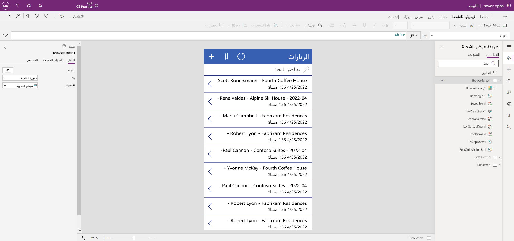

---
lab:
  title: 'النشاط المعملي 2: كيفية إنشاء تطبيق لوحة'
  module: 'Module 3: Get started with Power Apps'
---

# النشاط المعملي 2: كيفية إنشاء تطبيق لوحة

**مستأجرو WWL - شروط الاستخدام** إذا تم تزويدك بمستأجر كجزء من تقديم تدريب بقيادة مدرب، يرجى ملاحظة أن المستأجر متاح لغرض دعم المختبرات العملية في التدريب الذي يقوده المعلم. يجب عدم مشاركة المستأجرين أو استخدامها لأغراض خارج المختبرات العملية. المستأجر المستخدم في هذه الدورة التدريبية هو مستأجر تجريبي ولا يمكن استخدامه أو الوصول إليه بعد انتهاء الفئة وغير مؤهل للامتداد. يجب عدم تحويل المستأجرين إلى اشتراك مدفوع. يظل المستأجرون الذين تم الحصول عليها كجزء من هذه الدورة التدريبية ملكا ل Microsoft Corporation ونحتفظ بالحق في الحصول على حق الوصول والمستودعات في أي وقت. 

## السيناريو

Bellows College مؤسسة تعليمية يضم حرمها الجامعي العديد من المباني. يتم تسجيل زيارات الحرم الجامعي حاليًا في دفاتر ورقية. ولا يتم جمع المعلومات بشكل متسق، ولا توجد وسيلة لجمع وتحليل البيانات المتعلقة بالزيارات عبر الحرم الجامعي بأكمله.

حاليًا، تستفيد إدارة الحرم الجامعي من جدول بيانات Excel، لتعقب تسجيل الزوار. إنها ترغب في تحديث نظام تسجيل الزوار، بحيث يتم التحكم في الوصول إلى المباني من قبل أفراد الأمن، ويجب أن تكون جميع الزيارات مسجلة مسبقاً ويتم تسجيلها من قبل مضيفيها.

خلال هذه الدورة التدريبية، ستقوم بإنشاء تطبيقات وتفعيل التشغيل الآلي لتمكين موظفي إدارة وأمن Bellows College من إدارة الوصول إلى مباني الحرم الجامعي والتحكم فيه.

## خطوات معملية عالية المستوى

سنتبع المخطط أدناه لتصميم تطبيق اللوحة:

- إنشاء تطبيق اللوحة من البيانات في جدول "الزيارة"

- تكوين كيفية عرض الزيارات على شاشة المتصفح

- إجراء بعض التغييرات الأساسية على التطبيق

- اختبار وظيفة التطبيق

## المتطلبات الأساسية

- إكمال **الوحدة 0 المختبر 0 - التحقق من صحة بيئة المختبر**
- إكمال **الوحدة 2 النشاط المعملي 1 - نمذجة البيانات**

## التمرين 1: إنشاء تطبيق اللوحة للزيارات

**الهدف:** في هذا التمرين، ستقوم بإنشاء تطبيق لوحة عن طريق توصيل جدول الزيارات الذي أنشأته سابقا.

### المهمة \#1: إنشاء تطبيق الزيارات

1.  انتقل إلى ⁧<https://make.powerapps.com>⁩. قد تحتاج إلى إعادة المصادقة - حدد **تسجيل الدخول** واتبع الإرشادات إذا لزم الأمر.

2.  حدد بيئة **الممارسة (الأحرف الأولى من اسمي)** في أعلى اليمين، إذا لم تكن محددةً بالفعل.

3.  حدد **+ Create** من شريط التنقل الأيسر للشاشة. ضمن قسم **البدء من**، حدد **Dataverse**.

4.  حدد اتصال Dataverse لديك.

    > **ملاحظة:** *إذا لم يكن اتصال Dataverse موجودا:*
    > - تحديد **+اتصال جديد**
    > - حدد موقع **Microsoft Dataverse**
    > - حدد ⁧**⁩Create⁧**⁩
    > - **تسجيل الدخول** وتحديد **السماح بالوصول**

5.  حدد موقع جدول **الزيارات** الذي أنشأته في النشاط المعملي السابق وحدده.

6.  حدد الزر **الاتصال** في الزاوية السفلية اليمنى.

7.  بعد إنشاء تطبيقك، في شاشة مرحبا بك في Power Apps Studio، حدد **عدم إظهار هذا مرة أخرى**، ثم حدد **تخطي**.

8.  بعد اكتمال الإنشاء، يجب أن يبدو تطبيق Canvas مثل الصورة أدناه:

    

9.  في مصمم التطبيق، حدد زر **معاينة التطبيق (أيقونة** التشغيل) على شريط الأوامر. *(يمكنك أيضا معاينة التطبيق بالضغط على F5.)* ألق نظرة حولك وشاهد كيف يبدو تطبيقك خارج الصندوق.

10. أغلق معاينة التطبيق عن طريق تحديد **X** في الجزء العلوي الأيمن من الشاشة.

تهانينا، لقد نجحت في إنشاء Power App من جدول Dataverse. الخطوة التالية في العملية هي تخصيص التطبيق لمطابقة العلامة التجارية لكلية Bellows. سترشدك السلسلة التالية من الخطوات من خلال توفير بعض التخصيصات الإضافية للتطبيق.

### المهمة \#2: تعديل وإضافة وسم التطبيق الذي تم إنشاؤه حديثاً

في هذه المهمة، ستقوم بتخصيص نص العنوان على كل شاشة من الشاشات الثلاث لتطبيقك (استعراض وتفاصيل وتحرير) وتغيير موضوع التطبيق. 

1.  أنت الآن على شاشة استعراض. حدد تسمية **الزيارات** على الشاشة.

1.  على الجانب الأيمن من الشاشة، ضمن علامة التبويب خصائص، قم بتحديث خاصية التحكم **في النص** إلى `Bellows College Visits`

1.  في علامة التبويب **خصائص** ، قم بتغيير **حجم الخط** إلى **24**. 

1.  حدد الخلفية الفارغة للشاشة لمشاهدة النص المحدث على شاشة الاستعراض. 

1.  باستخدام **طريقة عرض الشجرة** في التنقل الأيسر، حدد **DetailScreen1**. 

1.  حدد تسمية **الزيارات** على الشاشة.

1.  على الجانب الأيمن من الشاشة، ضمن علامة التبويب **خصائص** ، قم بتحديث خاصية التحكم **في النص** إلى `Visit Details`

1.  انقر في الخلفية الفارغة للشاشة لمشاهدة النص المحدث على شاشة التفاصيل.

1.  باستخدام **طريقة عرض الشجرة** في التنقل الأيسر، حدد **EditScreen1** (قد تحتاج إلى التمرير لأسفل لرؤية ذلك على طريقة عرض الشجرة).

1.  حدد تسمية **الزيارات** على الشاشة.

1.  على الجانب الأيسر من الشاشة، في علامة التبويب **خصائص** ، استبدل النص الموجود في خاصية عنصر تحكم **النص** ب `Edit Details`

1.  انقر في الخلفية الفارغة للشاشة لمشاهدة النص المحدث على شاشة التحرير.

1.  باستخدام **طريقة عرض الشجرة**، في شريط التنقل الأيسر، حدد **BrowseScreen1**.

1.  في شريط أدوات الأوامر، حدد الزر **نسق** ومن القائمة التي تظهر، حدد لون النسق **الأحمر** .

### المهمة \#3: اختبر تطبيق "الزيارات" خاصتك

في هذه المهمة، ستختبر تطبيقك الجديد.

1.  مع فتح التطبيق الخاص بك في المصمم التطبيق، حدد **الإعدادات**، في القسم **عام** قم بتحديث اسم التطبيق الخاص بك لتحديد `Visits App` **X** لإغلاق شاشة الإعدادات ثم حدد **حفظ**.

2.  باستخدام جزء التنقل على اليسار، حدد **BrowseScreen1**.

3.  في مصمم التطبيق، حدد زر **معاينة التطبيق (أيقونة** التشغيل) على شريط الأوامر. *(يمكنك أيضا معاينة التطبيق بالضغط على F5.)*

4.  بمجرد فتح التطبيق، في حقل **عناصر البحث** ، أدخل النص `Maria`
     *(لاحظ كيفية تصفية العناصر الموجودة في المعرض استنادا إلى ما تم كتابته في حقل البحث).*

5.  بمجرد عرض سجل **Contoso Suites** ل **Maria Campbell** ، حدد صفا للتنقل وفتح شاشة التفاصيل لتلك الزيارة. (**ملاحظة**: *إذا تم عرض أكثر من سجل Contoso Suites Maria Campbell واحد، فحدد أيا منها.*)

6.  لتحرير السجل، حدد **أيقونة القلم الرصاص** في الزاوية العلوية اليمنى من التطبيق.

7.  يمكنك تحرير **اسم الزيارة** هنا وتحديد أيقونة **علامة الاختيار** في أعلى اليمين لحفظ التغيير.

8.  في الجزء العلوي الأيسر من الشاشة، حدد أيقونة **X** لإغلاق وضع المعاينة والعودة إلى محرر تطبيق اللوحة.

تهانينا! لقد أنشأت أول تطبيق لوحة وقمت بتكوينه.

