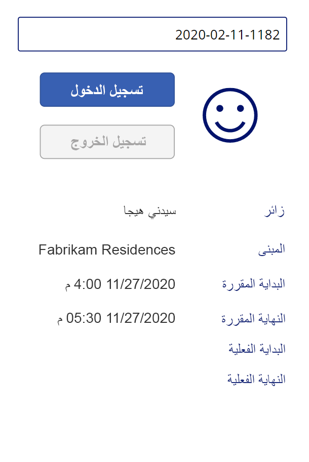

<div id="readme" class="Box-body readme blob js-code-block-container p-5 p-xl-6 gist-border-0" dir="rtl">
    <article class="markdown-body entry-content container-lg" itemprop="text"><table>
  <thead>
  <tr>
  <th>lab</th>
  </tr>
  </thead>
  <tbody>
  <tr>
  <td><div><table>
  <thead>
  <tr>
  <th>title</th>
  <th>module</th>
  </tr>
  </thead>
  <tbody>
  <tr>
  <td><div>النشاط المعملي 3: كيفية إنشاء تطبيق اللوحة، الجزء 2</div></td>
  <td><div>لوحدة 3: بدء استخدام Power Apps</div></td>
  </tr>
  </tbody>
</table>
</div></td>
  </tr>
  </tbody>
</table>

# الوحدة 3: بدء استخدام Power Apps
## النشاط المعملي 2: كيفية إنشاء تطبيق اللوحة، الجزء 2

# السيناريو

Bellows College مؤسسة تعليمية يضم حرمها الجامعي العديد من المباني. يتم تسجيل زيارات الحرم الجامعي حاليًا في دفاتر ورقية. ولا يتم جمع المعلومات بشكل متسق، ولا توجد وسيلة لجمع وتحليل البيانات المتعلقة بالزيارات عبر الحرم الجامعي بأكمله. 

ترغب إدارة الحرم الجامعي في تحديث نظام تسجيل الزوار، بحيث يتم التحكم في الوصول إلى المباني من قبل أفراد الأمن، ويجب أن تكون جميع الزيارات مسجلة مسبقًا ويتم تسجيلها من قبل مضيفيها.

خلال هذه الدورة التدريبية، ستقوم بإنشاء تطبيقات وتفعيل التشغيل الآلي لتمكين موظفي إدارة وأمن Bellows College من إدارة الوصول إلى مباني الحرم الجامعي والتحكم فيه. 

في الجزء الثاني من هذا النشاط المعملي، ستقوم بإنشاء تصميم وبناء تطبيق لوحة Power Apps الذي سيستخدمه أفراد الأمن عند مداخل المبنى لتأكيد الزائرين وتسجيلهم بسرعة.

# خطوات معملية عالية المستوى

ستتبع المخطط أدناه لتصميم تطبيق اللوحة:

-   إنشاء التطبيق باستخدام عوامل شكل الهاتف
-   الاتصال بـ Dataverse كمصدر بيانات
-   التقاط الإدخال (رمز الزائر) وتحديد موقع صف الزائر
-   تكوين نهج ضبط عارض النماذج لإظهار معلومات الزائر
-   استخدام طريقة عرض Dataverse للترويج للمعرض
-   القيام بعملية تسجيل دخول وخروج الزائر

## المتطلبات الأساسية

* إكمال **الوحدة 0 المختبر 0 - التحقق من صحة بيئة المختبر**
* إكمال **الوحدة 2 المختبر 1 - مقدمة إلى Microsoft Dataverse**

## الأشياء الواجب مراعاتها قبل البدء

-   ما المعلومات التي يحتاج موظف الأمن الوصول إليها بسرعة؟
-   ماذا يجب أن يحدث إذا كان رمز الزائر غير صالح؟
-   ماذا يجب أن يحدث إذا وصل الزائر في أوقات غير الساعات المجدولة؟

# تمرين \#1: إنشاء تطبيق لوحة لأفراد الأمن

**الهدف:** في هذا التمرين، ستقوم بإنشاء تطبيق اللوحة.

## المهمة \#1: إنشاء تطبيق اللوحة

1.  افتح حل Campus Management.

    -   سجل الدخول إلى<https://make.powerapps.com>

    -   إذا لم تكن البيئة المعروضة في أعلى اليمين هي بيئة التمرين الخاصة بك، فحدد **بيئتك**. 

    -   حدد **الحلول**.

    -   انقر لفتح حل **Campus Management**.
    
2.  أنشئ تطبيق لوحة جديدًا

    -   انقر فوق **جديد** وحدد **تطبيق\| تطبيق اللوحة**.

    -   في تطبيق اللوحة من نافذة فارغة، أدخل **[اسم العائلة] Campus Security** في الحقل "اسم التطبيق".

    -   حدد **الهاتف** في الحقل "تنسيق".

    -   انقر فوق **إنشاء**.
        سيفتح هذا محرر التطبيق في نافذة جديدة. انقر فوق **تخطي** إذا ظهر مع رسالة ترحيب خاصة بـ Power Apps Studio.
    
3.  احفظ تطبيق اللوحة

    -   انقر فوق **ملف** وحدد **حفظ باسم**.
    
    -   تحقق ما إذا تم تحديد **السحابة**، ثم انقر فوق **حفظ**.

    -   تحقق من **[اسم العائلة] Campus Security** في الاسم، ثم انقر فوق **حفظ**.
        
    -   انقر فوق سهم **العودة** في أعلى اليسار (تحت Power Apps) للرجوع إلى التطبيق.

3.  الاتصال بمصدر البيانات (الزيارات)

    -   انقر فوق **عرض \| موارد البيانات**
    
    -   انقر فوق **+ إضافة بيانات**

    -   انقر فوق **مشاهدة كل الجداول**
    
    -   حدد **الزيارات** وانتظر حتى يتم عرض جدول الزيارة في علامة التبويب البيانات.
    
4.  للاحتفاظ بالعمل قيد التقدم، انقر فوق **ملف** ثم انقر فوق **حفظ**. انقر فوق سهم العودة للرجوع إلى التطبيق.

## المهمة \#2: عرض معلومات الزائر

1.  إضافة مربع بحث

    -   حدد علامة التبويب **العرض الشجري** على لوحة التنقل اليسرى.
    
    -   حدد **شاشة1**.
    
    -   انتقل إلى علامة التبويب **إدراج**.
    
    -   انقر فوق **النص** وحدد **إدخال نص**.
    
2.  حرر كائن إدخال النص

    -   أثناء عملية تحديد كائن إدخال النص، حدد النص في الخاصية **الافتراضية** وامسح القيمة.
    
    -   حدد خاصية **نص التلميح** وأدخل `"Enter visitor code"` كقيمة (متضمنًا علامات الاقتباس المزدوجة)
    
    -   انقر فوق **[...]** بجوار اسم عنصر التحكم في طريقة العرض الشجري (TextInput1)، وحدد **إعادة تسمية**، وقم بتغيير الاسم إلى `textCode`
    
3.  إضافة نموذج عرض

    -   في علامة التبويب **إدراج** انقر فوق **نماذج**، ثم حدد **عرض** (قد تحتاج إلى النقر فوق السهم لأسفل على الجانب الأيمن من الشريط لرؤية النماذج)
   
    -   اسحب لوضع النموذج ومحاذاته مع الجزء السفلي من الشاشة
   
    -   أثناء تحديد النموذج الجديد، حدد خاصية **DataSource** وحدد **زيارات**
   
    -   في جزء الخصائص حدد **أفقي** في **التخطيط**

4.  تحرير طريقة عرض النموذج

    -   أثناء تحديد النموذج الجديد، انقر فوق **تحرير الحقول**

    -   قم بإزالة حقلي **الاسم** و**إنشاء في**

    -   انقر فوق **إضافة حقل** وحدد الحقول التالية: **الانتهاء الفعلي**، **البدء الفعلي**، **المبنى**، **الانتهاء المجدول**، **البدء المجدول**، **الزائر**
   
    -   اضغط على **إضافة**
   
    -   قم بتغيير ترتيب الحقول المحددة عن طريق سحب بطاقات الحقول في القائمة. الترتيب الموصى به هو: الزائر، المبنى، البدء المجدول، الانتهاء المجدول، البدء الفعلي، الانتهاء الفعلي (يمكنك إغلاق الحقول لتسهيل سحبها)
   
    -   انقر فوق **X** لإغلاق جزء الحقول
   
5.  أثناء تحديد طريقة عرض النموذج، حدد علامة التبويب "الخيارات المتقدمة" في جزء الخصائص. حدد خاصة **العنصر** وأدخل `LookUp(Visits, Code = textCode.Text)` 

6.  للاحتفاظ بالعمل قيد التقدم، انقر فوق **ملف** ثم انقر فوق **حفظ**. انقر فوق سهم العودة للرجوع إلى التطبيق.

7.  استعد لاختبار التطبيق

    -   انتقل إلى علامة تبويب المتصفح الذي يحتوي على الحل

    -   انقر فوق **تم** في النافذة المنبثقة
   
    -   حدد جدول **الزيارة**
   
    -   حدد علامة تبويب **البيانات**
   
    -   افتح محدد العرض في الجزء العلوي الأيمن من خلال النقر فوق اسم العرض الحالي، **الزيارات النشطة**
   
    -   غيّر طريقة العرض إلى **كافة الأعمدة**
   
    -   حدد موقع صف الزيارة الذي لا يحتوي على قيمة البدء الفعلي أو الانتهاء الفعلي (على سبيل المثال، كلا العمودين فارغان). حدد **رمز** هذه الزيارة وانسخه.

8.  اختبار التطبيق

    -   انتقل إلى علامة تبويب المتصفح باستخدام التطبيق، واضغط على **F5** أو انقر فوق أيقونة **تشغيل** في الزاوية العلوية اليمنى لمعاينة التطبيق.
   
    -   الصق القيمة المنسوخة في صندوق البحث، وتحقق من عرض السجل في النموذج
   
9.  امسح محتويات مربع نص البحث.
   
10.  اضغط على **ESC** للخروج من تشغيل التطبيق.

## المهمة \#3: إضافة أزرار تسجيل الوصول والمغادرة

في هذه المهمة، سننشئ أزرارًا للمستخدم لتسجيل الوصول والمغادرة من زيارته. 

1. احفظ نتائج البحث في متغير لإعادة استخدامه عبر نهج التحكم

    * حدد عنصر التحكم **رمز النص**
   
    * في جزء الخصائص، حدد علامة تبويب **الخيارات المتقدمة** وحدد خاصية **عند التغيير**
   
    * أدخل التعبير التالي ‏`Set(Visit, LookUp(Visits, Code = textCode.Text))`
    
    > سيؤدي هذا إلى حفظ الزيارة في متغير عام عندما يبحث المستخدم في مربع بحث رمز النص. يتيح لنا ذلك استخدام المتغير *الزيارة* عبر التطبيق دون الحاجة إلى إعادة إدخال تعبير البحث بالكامل.

2. إضافة زر تسجيل الوصول

   * حدد علامة التبويب **إدراج**
   
   * انقر فوق **الزر**
   
   * في جزء الخصائص، غيّر خاصية **نص** الزر إلى "`Check In`" (يمكنك الكتابة داخل علامات الاقتباس الموجودة)
   
   * انقر فوق **[...]** بجوار اسم الزر في طريقة العرض الشجري (الزر1)، حدد **إعادة تسمية**، وغيّر الاسم إلى `CheckInButton`

3. إضافة زر تسجيل المغادرة   

   * انقر فوق **زر** في علامة تبويب إدراج لإدراج زر آخر
   
   * في جزء الخصائص، غيّر خاصية **نص** الزر إلى "`Check Out`" (يمكنك الكتابة داخل علامات الاقتباس الموجودة)
   
   * أعد تسمية الزر باسم `CheckOutButton`
   
   * ضع الأزرار أسفل مربع البحث، **تسجيل الوصول** أعلى **تسجيل المغادرة** 
   
## المهمة \#4: تمكين وتعطيل الأزرار بناءً على بيانات الزيارة

بمجرد أن يبحث المستخدمون عن الزيارة، نود أن يستخدموا زر تسجيل الوصول لتسجيل وصولهم لتلك الزيارة. نرغب في تمكين زر **تسجيل الوصول** عندما يتم تحديد موقع سجل الزيارة (لا يكون فارغًا)، وحالة السجل نشطة، ولم تبدأ الزيارة بعد، أي أن قيمة البدء الفعلية فارغة.

1. حدد زر **تسجيل الوصول** وانقر فوق زر خاصية **وضع العرض** في علامة تبويب الخصائص

2. أدخل التعبير أدناه في شريط الوظائف:

      ```
      If(!IsBlank(Visit) 
      && Visit.Status = 'Status (Visits)'.Active
      && IsBlank(Visit.'Actual Start'),
          DisplayMode.Edit,
          DisplayMode.Disabled
      )
      ```

   يمكن تحليل التعبير على النحو التالي:

   * **!IsBlank(Visit)** - تم العثور على سجل زيارة
   * **&&** -  المنطقي والعامل
   * **Visit.Status = 'Status (Visits)'.Active** حالة السجل *نشطة*
   * **IsBlank(Visit.'Actual Start')** - لا يحتوي حقل البدء الفعلي على أي بيانات
   * **DisplayMode.Edit, DisplayMode.Disabled** - إذا تم استيفاء الشروط المذكورة أعلاه، فسيصبح الزر قابلاً للتحرير. إذا لم يكن الأمر كذلك، فسيظل الزر معطلًا.

نرغب في تمكين زر **تسجيل المغادرة** عندما يتم تحديد موقع سجل الزيارة (ليس فارغًا)، وحالة السجل نشطة، وقد بدأت الزيارة بالفعل، أي أن قيمة البدء الفعلي ليست فارغة.

3. حدد زر تسجيل المغادرة وانقر فوق خاصية **وضع العرض** في علامة تبويب الخصائص

4. أدخل التعبير أدناه في شريط الوظائف:

     ```
     If(!IsBlank(Visit) 
     && Visit.Status = 'Status (Visits)'.Active
     && !IsBlank(Visit.'Actual Start'),
         DisplayMode.Edit,
         DisplayMode.Disabled
     )
     ```

5. للاحتفاظ بالعمل قيد التقدم، انقر فوق **ملف** ثم انقر فوق **حفظ**. انقر فوق سهم العودة للرجوع إلى التطبيق.

6. اضغط على **F5** لتشغيل التطبيق. 

7. يجب تعطيل كلا الزرين. أدخل قيمة الرمز التي نسختها مسبقًا واضغط على **علامة التبويب** لنقل التركيز بعيدًا عن مربع النص (أو انقر خارج مربع النص). يجب تمكين زر **تسجيل الوصول**. 

8. امسح محتويات مربع البحث.

9. اضغط على **ESC** للخروج من تشغيل التطبيق.

## المهمة \#5: أكمل عملية تسجيل الوصول والمغادرة

لإجراء عملية تسجيل الوصول والمغادرة، نحتاج إلى تحديث بيانات زيارة Dataverse على النحو التالي:

* عندما يقوم الزائر بتسجيل الوصول، اضبط حقل *البدء الفعلي* على التاريخ والوقت الحاليين
* عندما يقوم الزائر بتسجيل المغادرة، اضبط حقل *الانتهاء الفعلي* على التاريخ والوقت الحاليين. 
* بعد تسجيل المغادرة، اضبط حالة السجل على أنه غير نشط، مما يشير إلى أن الزيارة قد تمت وانتهت

1. حدد زر **تسجيل الوصول**.

2. اضبط خاصية **OnSelect** في علامة تبويب الخيارات المتقدمة إلى التعبير التالي.

   ```
   Patch(
       Visits,
       Visit,
       {'Actual Start': Now()}
   );
   Refresh([@Visits]);
   Set(Visit, LookUp(Visits, Code = textCode.Text));
   ```

   يحتوي هذا التعبير على الأجزاء التالية:

   * **Patch(Visits, Visit, {'Actual Start': Now()});**. تقوم طريقة *التصحيح* بتحديث جدول **الزيارات**، ويعرف الصف بالمتغير **الزيارة** (وهي الزيارة الحالية). يعين التعبير قيمة عمود *البدء الفعلي* إلى التاريخ والوقت الحاليين (*طريقة* الآن()).
   * **Refresh([@Visits]);**. يعمل هذا التعبير على تحديث صفوف الزيارة، حيث تم تغيير القيم التابعة
   * **Set(Visit, LookUp(Visits, Code = textCode.Text));** يقوم هذا التعبير بتحديث متغير *الزيارة* ببيانات حديثة من Dataverse.
   
   > عندما ينقر المستخدم على هذا الزر، سيتم تعيين البدء الفعلي للزيارة على التاريخ والوقت الحاليين وسيتم تحديث البيانات.

3. حدد زر **تسجيل المغادرة**.

4. اضبط خاصية **OnSelect** في علامة تبويب الخيارات المتقدمة على التعبير التالي:

   ```
   Patch(
       [@Visits],
       Visit,
       {
           'Actual End': Now(),
           Status: 'Status (Visits)'.Inactive
       }
   );
   Refresh([@Visits]);
   Set(Visit, LookUp(Visits, Code = textCode.Text));
   ```

   عندما ينقر المستخدم على هذا الزر، سيتم تعيين الانتهاء الفعلي على التاريخ والوقت الحاليين، وسيتم تعيين حالة الزيارة على أنها غير نشطة، وسيتم تحديث البيانات.

5. للاحتفاظ بالعمل قيد التقدم، انقر فوق **ملف** ثم انقر فوق **حفظ**. استخدم سهم **العودة** للرجوع إلى التطبيق.

6. اضغط على زر **F5** أو انقر فوق زر التشغيل لتشغيل التطبيق. أدخل قيمة الرمز التي نسختها مسبقًا واضغط على **علامة التبويب** لنقل التركيز بعيدًا عن مربع النص. يجب تمكين زر **تسجيل الوصول**.

7. اضغط على زر **تسجيل الوصول**. يجب أن يحدث ما يلي:

   * يتم تعيين **البدء الفعلي** على التاريخ والوقت الحاليين
   
   * يتم تعطيل زر **تسجيل الوصول**
   
   * يتم تمكين زر **تسجيل المغادرة**

8. اضغط على زر **تسجيل المغادرة**.

   * يتم تعيين **الانتهاء الفعلي** على التاريخ والوقت الحاليين
   
   * يتم تعطيل كلا الزرين

9. امسح محتويات مربع البحث.

10. اضغط على **ESC** للخروج من تشغيل التطبيق.

## المهمة \#6: إضافة المؤشرات المرئية

تتحسن قابلية استخدام تطبيق الهاتف المحمول بشكل ملحوظ عند توفير مؤشرات مرئية. في هذه المهمة، سنضيف أيقونة تشير إلى إمكانية تسجيل وصول زائر أو مغادرته.

1. حدد علامة التبويب **إدراج**

2. حدد **الأيقونات \| إضافة**. حدد أيقونة. في هذه المرحلة، لا تهمنا الأيقونة التي نختارها لأننا نريد أن تكون القيمة ديناميكية.

3. غيّر حجم الأيقونة وضعها على يسار الأزرار

4. في علامة تبويب الخيارات المتقدمة للأيقونة، حدد خاصة **أيقونة** (في قسم التصميم) وأدخل التعبير التالي

   ```
   If(
      CheckInButton.DisplayMode = DisplayMode.Disabled 
   && CheckOutButton.DisplayMode = DisplayMode.Disabled,
       Icon.EmojiFrown,
       Icon.EmojiSmile
   )
   ```

5. للاحتفاظ بالعمل قيد التقدم، انقر فوق **ملف** ثم انقر فوق **حفظ**. استخدم سهم **العودة** للرجوع إلى التطبيق.

6. اضغط على **F5** لتشغيل التطبيق. أدخل قيمة الرمز التي نسختها مسبقًا واضغط على **علامة التبويب** لنقل التركيز بعيدًا عن مربع النص. تحقق من أن الأيقونة تعرض تعبير العبوس.

7. ابحث عن قيمة رمز مختلفة لم يتم استخدامها من قبل (يجب ألا تحتوي على قيمة البدء الفعلي أو قيمة الانتهاء الفعلي). 

    > بإمكانك الانتقال إلى علامة التبويب السابقة لنسخ رمز آخر من إحدى الزيارات التي قمت بإنشائها. لديك أيضًا خيار تشغيل تطبيق **Campus Staff** الذي تم إنشاؤه مسبقًا لإنشاء سجلات زيارات جديدة. تحقق من أن الأيقونة تعرض تعبير الابتسامة لهذا الرمز.

يجب أن يبدو تطبيقك قيد التشغيل كما يلي تقريبًا:



8. اضغط على **ESC** للخروج من تشغيل التطبيق.

## المهمة رقم 7: نشر التطبيق

1. يجب أن يظل تطبيق Campus Security مفتوحًا في متصفحك. إذا لم يكن كذلك، فحدد تطبيق **Campus Security** وانقر فوق **تحرير**.

2. حدد **ملف \| نشر** 

3. حدد **نشر هذا الإصدار**

# تحديات

* تجنب الإدخال اليدوي لرمز الزيارة
* إضافة التحقق من المبنى للزيارة
* إضافة التحقق من صحة الوقت الفعلي للزيارة مقارنة بالوقت المجدول للزيارة (مبكر جدًا، متأخر جدًا، إلخ)
* إضاقة حالة مفصلة للزيارة، على سبيل المثال عرض البريد الإلكتروني والتحقق من الزائر، وسبب رفض الوصول إلى المبنى، إلخ
* مبان/اجتماعات/فحوصات متعددة خلال زيارة واحدة للحرم الجامعي. على سبيل المثال، قد يقوم شخص ما بزيارة الحرم الجامعي ليوم واحد وخلال ذلك اليوم يلتقي مع أعضاء فريق العمل في مبانٍ متعددة في أوقات مختلفة من اليوم. هل تفكر في إدخال عنصر *المواعيد* في الحل؟
