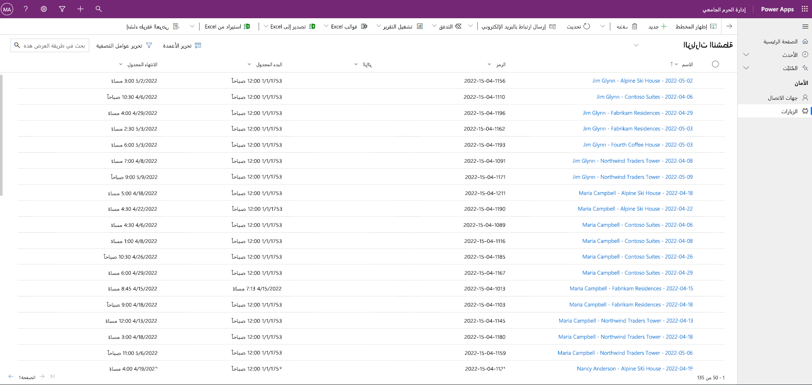

---
lab:
  title: 'النشاط المعملي 3: كيفية إنشاء تطبيق يستند إلى نموذج'
  module: 'Module 3: Get started with Power Apps'
---

# النشاط المعملي 3: كيفية إنشاء تطبيق يستند إلى نموذج

## السيناريو

Bellows College مؤسسة تعليمية يضم حرمها الجامعي العديد من المباني. يتم حاليًا تسجيل زوار الحرم الجامعي في دفاتر عمل ورقية. ولا يتم جمع المعلومات بشكل متسق، ولا توجد وسيلة لجمع وتحليل البيانات المتعلقة بالزيارات عبر الحرم الجامعي بأكمله.

ترغب إدارة الحرم الجامعي في تحديث نظام تسجيل الزوار، بحيث يتم التحكم في الوصول إلى المباني من قبل أفراد الأمن، ويجب أن تكون جميع الزيارات مسجلة مسبقًا ويتم تسجيلها من قبل مضيفيها.

خلال هذه الدورة التدريبية، ستقوم بإنشاء تطبيقات وتفعيل التشغيل الآلي لتمكين موظفي إدارة وأمن Bellows College من إدارة الوصول إلى مباني الحرم الجامعي والتحكم فيه.

في هذا النشاط المعملي، ستنشئ تطبيق Power Apps يستند إلى نموذج للسماح لفريق عمل الحرم الجامعي بإدارة سجلات الزيارة عبر الحرم الجامعي بأكمله.

خطوات معملية عالية المستوى

كجزء من إنشاء التطبيق المستند إلى النموذج، ستكمل ما يلي:

- إنشاء تطبيق جديد يستند إلى نموذج يطلق عليه Bellows Campus Management

- تحرير لوحة التنقل في التطبيق للإشارة إلى الجداول المطلوبة

- تخصيص النماذج وطرق عرض الجداول المطلوبة للتطبيق

سنعمل مع المكونات التالية:

- **طرق العرض**: تسمح طرق العرض للمستخدم بعرض البيانات الموجودة في جدول النموذج.

- **النماذج**: حيث يقوم المستخدم بإنشاء/تحديث صفوف جديدة في الجداول.

سيتم دمج كليهما في التطبيق المستند إلى النموذج للحصول على تجربة مستخدم أفضل.

المتطلبات الأساسية

- إكمال **الوحدة 0 المختبر 0 - التحقق من صحة بيئة المختبر**
- إكمال **الوحدة 2 النشاط المعملي 1 - نمذجة البيانات**

الأشياء الواجب مراعاتها قبل البدء

- ما التغييرات التي يجب أن نجريها لتحسين تجربة المستخدم؟
- ما الذي يجب تضمينه في التطبيق المستند إلى نموذج بناءً على نموذج البيانات الذي قمنا ببنائه؟
- ما التخصيصات التي يمكن إجراؤها على خريطة الموقع لتطبيق يستند إلى نموذج؟

## التمرين 1: تخصيص طرق العرض والنماذج

**Objective:** في هذا التمرين، ستقوم بتخصيص طرق عرض ونماذج الجداول المُنشأة المخصصة التي سيتم استخدامها في التطبيق المستند إلى النموذج.

### المهمة \#1: تحرير نموذج الزيارة

1. سجّل الدخول إلى [https://make.powerapps.com](https://make.powerapps.com/) إذا لم تكن قد سجلت الدخول مسبقًا.

2. حدد بيئة **الممارسة (الأحرف الأولى من اسمي)** في أعلى اليمين، إذا لم تكن محددةً بالفعل.

3. باستخدام جزء التنقل على اليسار، بادر بتوسيع **Dataverse**، وحدد **الجداول**، وانقر لفتح جدول **الزيارة** لديك.

   إذا لم يظهر جدول Visit، فتأكد من أنك في البيئة الصحيحة (الخطوة 2).

4. ضمن القسم **تجارب البيانات**، حدد **النماذج** وانقر لفتح نموذج المعلومات بنوع النموذج **الرئيسي**.

**IMPORTANT:** نظراً لأن جميع النماذج تسمى معلومات بشكل افتراضي، يرجى التحقق من أن النموذج الذي تحدده من النوع **الرئيسي** وليس شيئاً آخر. بشكل افتراضي، يحتوي النموذج على حقلين: الاسم والمالك.

5. على الجانب الأيمن من الشاشة ضمن لوحة خصائص، حدد حقل **اسم العرض**، وقم بتغييره إلى **معلومات رئيسية**.

6. حدد **Table Columns** من جزء التنقل الأيسر وأضف الحقول التالية أسفل حقل **Owner** عن طريق سحب الأعمدة إلى النموذج أو ببساطة النقر فوق أسماء الأعمدة:

    1. **Visitor**

    1. **Scheduled Start**

    1. **Scheduled End**

    1. **Actual Start**

    1. **Actual End**

7. اسحب عمود **الرمز** وأفلته في رأس النموذج.

الرأس هي المنطقة العلوية اليمنى من النموذج. قد تحتاج إلى طوي لوحة الخصائص على الجانب الأيمن من الشاشة لرؤية الحقل في النموذج.

8. مع استمرار تحديد حقل **التعليمة البرمجية**، حدد خانة الاختيار **للقراءة فقط** في لوحة الخصائص على الجانب الأيمن من الشاشة.

9. حدد حقل **المالك**. في لوحة الخصائص، غيّر **تسمية** إلى **مضيف**

10. انقر فوق **حفظ** في الجزء العلوي الأيمن وانتظر حتى يكتمل الحفظ.

11. انقر فوق **نشر** في الجزء العلوي الأيمن وانتظر حتى يكتمل النشر.

12. إذا تم فتح طريقة عرض التحرير في علامة تبويب أو نافذة مستعرض جديدة، فقم بإغلاقها. انقر فوق **Back** في أعلى يسار الشاشة. يجب أن تعود الآن إلى نماذج جداول الزيارة.

13. استخدام مسارات التنقل في الزاوية العلوية اليمنى (الجداول>الزيارة>النماذج). حدد **الزيارة** للعودة إلى الشاشة الرئيسية لجدول **الزيارة**.

### المهمة \#2: تحرير عرض الزيارات النشطة

في هذه المهمة، سنقوم بتعديل طريقة العرض الافتراضية «للزيارات النشطة» وإنشاء طريقة عرض جديدة لزيارات اليوم.

1. ضمن قسم **تجارب البيانات**، حدد **طرق العرض** وانقر لفتح طريقة عرض **الزيارات النشطة**.

2. أضف الحقول التالية إلى طريقة العرض إما بالنقر فوق الحقول أو سحبها وإفلاتها:

    1. **رمز**

    2. **Visitor**

    3. **Scheduled Start**

    4. **Scheduled End**

3. انقر فوق عمود **أُنشئ في** وحدد **إزالة**. ستتم الآن إزالة حقل **أُنشئ في** من العرض.

4. اضبط قياس الأعمدة الفردية ليناسب البيانات.

5. ضمن **Sort by ...** حدد X لإزالة **Name** وبدلاً من ذلك، حدد **Scheduled Start**.

6. حدد **Scheduled Start** لتغيير ترتيب الفرز إلى **Newer to Older**.

7. انقر فوق **حفظ** وانتظر حتى يتم حفظ التغييرات.

8. انقر فوق **نشر** وانتظر حتى يكتمل النشر.

### المهمة #3: إنشاء طريقة عرض جديدة لزيارات اليوم

سنقوم الآن باستنساخ طريقة العرض لإنشاء طريقة عرض جديدة لزيارات اليوم.

هام: تأكد من عدم إغلاق طريقة عرض «الزيارات النشطة»، لأننا سنستفيد منها لإنشاء طريقة عرض الزيارات الجديدة اليوم.

1. انقر فوق **سهم القائمة المنسدلة** بجانب زر الحفظ (احرص على عدم الضغط على الزر نفسه) وحدد **حفظ باسم**.

2. غيّر الاسم إلى **زيارات اليوم**، واضغط على **حفظ**.

3. اضغط على رابط **تحرير عوامل التصفية** في لوحة الخصائص.

4. انقر فوق **إضافة**، وحدد **إضافة صف**.

5. حدد **البداية المجدولة** كحقل، ثم حدد **اليوم** كشرط في القائمة المنسدلة.

6. انقر على **…** في صف **الحالة**، وانقر فوق **حذف** لحذف شرط عامل التصفية هذا.

7. اضغط على **موافق** لحفظ الشرط. تمت تصفية العرض الآن ليظهر فقط السجلات التي تاريخ بدئها المجدول هو اليوم.

8. أضف حقلي **البداية الفعلية** و**النهاية الفعلية** إلى طريقة العرض.

**ملاحظة:** نظرًا لأننا لم نعد نصفي حالة العرض، فسنحصل على جميع زيارات اليوم بما في ذلك الزيارات المكتملة. ستساعد هذه الحقول على التمييز بين الزيارات المكتملة والزيارات الجارية.

9. انقر فوق **حفظ** وانتظر حتى يتم حفظ التغييرات.

10. انقر فوق **نشر** وانتظر حتى يكتمل النشر.

## التمرين 2: إنشاء تطبيق يستند إلى نموذج

**الهدف:** في هذا التمرين، ستقوم بإنشاء تطبيق يستند إلى نموذج، وتخصيص خريطة الموقع، واختبار التطبيق.

من أجل البساطة والوقت، لن نتناول بعض أعمدة الزيارة في هذا النشاط المعملي.

### المهمة \#1: إنشاء تطبيق

1. سجّل الدخول إلى [https://make.powerapps.com](https://make.powerapps.com/) (إذا لم تكن قد سجلت الدخول بالفعل).

2. حدد بيئة **الممارسة (الأحرف الأولى من اسمي)** في أعلى اليمين، إذا لم تكن محددةً بالفعل.

3.  عند الضرورة، انقر فوق أيقونة **الصفحة الرئيسية** على الجانب الأيسر من الشاشة.

3. إنشاء التطبيق المستند إلى النموذج:

    1. حدد **تطبيق فارغ** في قسم **البدء من** في الشاشة الرئيسية.

    1. ضمن **تطبيق فارغ يعتمد على Dataverse**، حدد **إنشاء**.

    1. أدخِل **إدارة الحرم الجامعي Bellows** للاسم وحدد **إنشاء**.

4. بعد تحميل التطبيق الجديد المستند إلى النموذج لديك، حدد الزر **+ إضافة صفحة**.

5. في شاشة Add Page، اختر **Dataverse table**، ثم حدد الزر **Next**.

6. أضِف الجداول التالية:

    1. زيارة

    1. جهة اتصال

7. بعد تحديد الجدولين، حدد **إضافة**.

8. باستخدام أيقونات التنقل على الجانب الأيسر من الشاشة، حدد **التنقل**.

9. في جزء التنقّل، حدد النص **مجموعة 1** أدناه حيث يظهر شريط التنقل. قد تحتاج إلى توسيع القائمة على اليسار.

10. على الجانب الأيمن من الشاشة، في القسم **Display options**، قم بتغيير خاصية **Title** إلى **Security**.

11. في جزء التنقّل، ضمن Security group، حدد **SubArea1**. 

12. حدد **علامة الحذف**، ومن القائمة التي تظهر، حدد **Remove from navigation**. 

13. حدد **Save** وانتظر حتى يتم حفظ التغييرات. 

14. بمجرد اكتمال **الحفظ**، حدد الزر **نشر** لنشر التغييرات خاصتك. 

### المهمة #2: اختبار التطبيق

1. بدء التطبيق

    1. حدد الزر **Play**، وسيتم تحميل التطبيق الجديد في علامة تبويب جديدة.

2. إنشاء جهة اتصال جديدة

    1. ينبغي أن يفتح التطبيق في عرض **جهات الاتصال النشطة**. إذا لم يكن كذلك، فحدد Contacts على اليسار.

    1. انقر فوق **+ New** من القائمة العلوية.

    1. أدخل **الاسم الأول** مثل "سمير" و**اسم العائلة** مثل "سليم".

    1. أدخل بريدك الإلكتروني الشخصي في **البريد الإلكتروني**. سيتم استخدامه في مختبر مستقبلي ستتلقى من خلاله رسالة بريد إلكتروني.

    1. انقر فوق **Save & Close**.

    1. يجب أن ترى الآن جهة الاتصال التي تم إنشاؤها في عرض **جهة الاتصال النشطة**.

3. إنشاء زيارة جديدة

    1. حدد **الزيارات** من شريط التنقل الأيسر لخريطة الموقع.

    1. انقر على **+ New**.

    1. أدخل الحقول على النحو التالي

        1. **الاسم**: زيارة اختبار جديدة

        1. **الزائر**: حدد فلان الفلاني

        1. **البداية المجدولة**: حدد تاريخ الغد والساعة 2:00 مساءً كوقت البدء

        1. **النهاية المجدولة**: حدد تاريخ الغد والساعة 3:30 مساءً كوقت الانتهاء

- انقر فوق **Save & Close**. سيؤدي هذا إلى إنشاء Visit ويجب أن تكون قادرًا على رؤيتها في Active Visits View.

- غيّر العرض إلى **Today’s Visits** باستخدام القائمة المنسدلة بجوار **Active Visits**. من المفترض ألا ترى الزيارة الجديدة في العرض، حيث إنها مجدولة للغد.

4. يمكنك إضافة المزيد من سجلات الاختبار.

يجب أن يبدو تطبيقك قيد التشغيل كما يلي تقريبًا:

تهانينا! لقد أنشأت أول تطبيق مستند إلى نموذج وقمت بتكوينه.

## التحديات

- حدد طرق عرض ونماذج معينة لـ Contacts.
