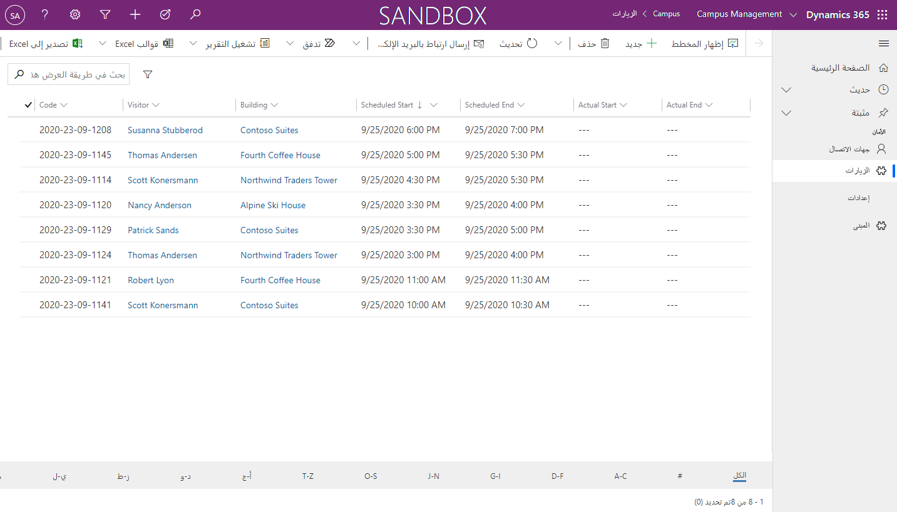



    <article class="markdown-body entry-content container-lg" itemprop="text"><table>
  <thead>
  <tr>
  <th>lab</th>
  </tr>
  </thead>
  <tbody>
  <tr>
  <td>
<table>
  <thead>
  <tr>
  <th>title</th>
  <th>module</th>
  </tr>
  </thead>
  <tbody>
  <tr>
  <td>
النشاط المعملي 4: كيفية إنشاء تطبيق يستند إلى نموذج
</td>
  <td>
لوحدة 3: بدء استخدام Power Apps
</td>
  </tr>
  </tbody>
</table>

</td>
  </tr>
  </tbody>
</table>

# الوحدة 3: بدء استخدام Power Apps
## النشاط المعملي 3: كيفية إنشاء تطبيق يستند إلى نموذج

### ملاحظة هامة (اعتبارًا من نوفمبر 2020):
تمت إعادة تسمية Common Data Service لتصبح Microsoft Dataverse. وتم تحديث بعض المصطلحات في Microsoft Dataverse. على سبيل المثال، العنصر (الآن **الجدول**)، والحقل (الآن **العمود**)، والتسجيل (الآن **صف**) قد تكون قديمة. يرجى وضع ذلك في الاعتبار أثناء عملك خلال الأنشطة المعملية. نتوقع تحديث المحتوى بالكامل قريبًا جدًا.

لمزيد من المعلومات وللحصول على قائمة كاملة بالمصطلحات المتأثرة، يرجى زيارة [ما هو Microsoft Dataverse؟](https://docs.microsoft.com/ar-sa/powerapps/maker/common-data-service/data-platform-intro#terminology-updates)

# السيناريو

Bellows College مؤسسة تعليمية يضم حرمها الجامعي العديد من المباني. يتم حاليًا تسجيل زوار الحرم الجامعي في دفاتر عمل ورقية. ولا يتم جمع المعلومات بشكل متسق، ولا توجد وسيلة لجمع وتحليل البيانات المتعلقة بالزيارات عبر الحرم الجامعي بأكمله. 

ترغب إدارة الحرم الجامعي في تحديث نظام تسجيل الزوار، بحيث يتم التحكم في الوصول إلى المباني من قبل أفراد الأمن، ويجب أن تكون جميع الزيارات مسجلة مسبقًا ويتم تسجيلها من قبل مضيفيها.

خلال هذه الدورة التدريبية، ستقوم بإنشاء تطبيقات وتفعيل التشغيل الآلي لتمكين موظفي إدارة وأمن Bellows College من إدارة الوصول إلى مباني الحرم الجامعي والتحكم فيه. 

في هذا النشاط المعملي، ستنشئ تطبيق Power Apps يستند إلى نموذج للسماح لفريق عمل الحرم الجامعي بإدارة سجلات الزيارة عبر الحرم الجامعي بأكمله.

# خطوات معملية عالية المستوى

كجزء من إنشاء التطبيق المستند إلى النموذج، ستكمل ما يلي:

-   إنشاء تطبيق جديد يستند إلى نموذج يطلق عليه Campus Management

-   تحرير لوحة التنقل في التطبيق للإشارة إلى الجداول المطلوبة

-   تخصيص النماذج وطرق عرض الجداول المطلوبة للتطبيق

سنعمل مع المكونات التالية:

- **طرق العرض**: تسمح طرق العرض للمستخدم بعرض البيانات الموجودة في جدول النموذج.

- **النماذج**: حيث يقوم المستخدم بإنشاء/تحديث صفوف جديدة في الجداول.

سيتم دمج كليهما في التطبيق المستند إلى النموذج للحصول على تجربة مستخدم أفضل.

## المتطلبات الأساسية

* إكمال **الوحدة 0 المختبر 0 - التحقق من صحة بيئة المختبر**
* إكمال **الوحدة 2 المختبر 1 - مقدمة إلى Microsoft Dataverse**

## الأشياء الواجب مراعاتها قبل البدء

-   ما التغييرات التي يجب أن نجريها لتحسين تجربة المستخدم؟

-   ما الذي يجب تضمينه في التطبيق المستند إلى نموذج بناءً على نموذج البيانات الذي قمنا ببنائه؟
    
-   ما التخصيصات التي يمكن إجراؤها على خريطة الموقع لتطبيق يستند إلى نموذج؟

# تمرين \#1: تخصيص طرق العرض والنماذج

**الهدف:** في هذا التمرين، ستقوم بتخصيص طرق عرض ونماذج الجداول المُنشأة المخصصة التي سيتم استخدامها في التطبيق المستند إلى النموذج.

## المهمة \#1: تحرير نموذج الزيارة

1.  سجّل الدخول إلى<https://make.powerapps.com> إذا لم تقم بتسجيل الدخول مسبقًا.

2.  حدد **البيئة** الخاصة بك.

3.  حدد **الحلول**.

4.  انقر لفتح حل **Campus Management**.

5.  انقر لفتح عنصر **الزيارة**.

6.  حدد علامة تبويب **النماذج** وانقر لفتح نوع النموذج **الرئيسي**. 

    > بشكل افتراضي، يحتوي النموذج على حقلين: الاسم (الحقل الأساسي) والمالك.
    
7.  حدد **+ حقل نموذج** وأضف الحقول التالية أسفل حقل **المالك** عن طريق سحب الأعمدة إلى النموذج أو ببساطة النقر فوق أسماء الأعمدة:

    * **المبنى**
    * **الزائر**
    * **البدء المجدول**
    * **الانتهاء المجدول**
    * **البدء الفعلي**
    * **الانتهاء الفعلي** 
    
8.  اسحب عمود **الرمز** وأفلته في رأس النموذج. 

    > الرأس هي المنطقة العلوية اليمنى من النموذج. قد تحتاج إلى تصغير لوحة الخصائص على الجانب الأيمن من الشاشة لرؤية الحقل في النموذج.

9.  مع استمرار تحديد حقل **الرمز**، حدد خانة الاختيار **للقراءة فقط** في لوحة الخصائص.

10.  حدد حقل **المالك**. في لوحة الخصائص، غيّر **وصف الحقل** إلى **مضيف**

11.  انقر فوق **حفظ** في الجزء العلوي الأيمن وانتظر حتى يكتمل الحفظ.

12.  انقر فوق **نشر** في الجزء العلوي الأيمن وانتظر حتى يكتمل النشر.

13.  انقر فوق **عودة** في أعلى يسار الشاشة. يجب أن تعود الآن إلى
     علامة تبويب نماذج عنصر الزيارة.

## المهمة \#2: تحرير طرق عرض الزيارة

في هذه المهمة، سنقوم بتعديل طريقة العرض الافتراضية للزيارات النشطة وإنشاء طريقة عرض جديدة لزيارات اليوم.

1.  حدد علامة تبويب **طرق العرض** وانقر لفتح عرض **الزيارات النشطة**.

2.  أضف الحقول التالية إلى طريقة العرض إما بالنقر فوق الحقول أو سحبها وإفلاتها:

    *  **الرمز**
    *  **الزائر**
    *  **المبنى**
    *  **البدء المجدول** 
    *  **الانتهاء المجدول**
    
3.  انقر فوق عمود **أُنشئ في** وحدد **إزالة**. ستتم الآن إزالة حقل **أُنشئ في** من العرض.

4.  انقر فوق عمود **الاسم** وحدد **إزالة**. ستتم الآن إزالة حقل **الاسم** من العرض.

5.  في لوحة الخصائص على اليمين، انقر فوق **فرز حسب...** وحدد **البداية المجدولة**. انقر فوق **البداية المجدولة** مرة أخرى لتغيير الترتيب إلى التنازلي.

6.  اضبط قياس الأعمدة الفردية ليناسب البيانات.

7.  انقر فوق **حفظ** وانتظر حتى يتم حفظ التغييرات.

8.  انقر فوق **نشر** وانتظر حتى يكتمل النشر.

سنقوم الآن باستنساخ طريقة العرض لإنشاء طريقة عرض جديدة لزيارات اليوم.

9.  اضغط على رابط **تحرير عوامل التصفية** في لوحة الخصائص.

10.  انقر فوق **إضافة**، وحدد **إضافة صف**.

11.  حدد **البداية المجدولة** كحقل، ثم حدد **اليوم** كشرط في القائمة المنسدلة. 

12.  انقر فوق **[...]** في صف **الحالة** وانقر فوق **حذف**. 

13.  اضغط على **موافق** لحفظ الشرط. تمت تصفية العرض الآن ليظهر فقط السجلات التي تاريخ بدئها المجدول هو اليوم.

14.  أضف حقلي **البداية الفعلية** و**النهاية الفعلية** إلى طريقة العرض. 

> **ملاحظة:** نظرًا لأننا لم نعد نصفي حالة العرض، فسنحصل على جميع زيارات اليوم بما في ذلك الزيارات المكتملة. ستساعد هذه الحقول على التمييز بين الزيارات المكتملة والزيارات الجارية.

15.  انقر فوق **سهم القائمة المنسدلة** بجانب زر الحفظ (احرص على عدم الضغط على الزر نفسه) وحدد **حفظ باسم**.

16.  غيّر الاسم إلى **زيارات اليوم** واضغط على **حفظ**.

17.  انقر فوق **نشر** وانتظر حتى يكتمل النشر.

# تمرين \#2: إنشاء تطبيق يستند إلى نموذج

**الهدف:** في هذا التمرين، ستقوم بإنشاء تطبيق يستند إلى نموذج، وتخصيص خريطة الموقع، واختبار التطبيق.

> سترى عدة حقول لم يتم إكمالها أثناء إنشاء التطبيق، لا سيما في خطوات خريطة الموقع. لقد اتخذنا بعض الطرق المختصرة من أجل أداء الأنشطة المعملية. في التطبيق الحقيقي، ستقوم بإعطاء هذه العناصر أسماء منطقية.

## المهمة \#1: إنشاء تطبيق

1.  افتح حل Campus Management إذا لم تكن مسجل الدخول إليه بالفعل.

    -   سجل الدخول إلى<https://make.powerapps.com>

    -   أثناء وجودك في بيئتك، انقر لفتح حل **Campus Management**.
    
2.  إنشاء تطبيق يستند إلى نموذج

    -   انقر فوق **جديد** وحدد **تطبيق** ثم **تطبيق يستند إلى نموذج**. سيؤدي هذا إلى فتح علامة تبويب جديدة.
    
    -   أدخل **(اسم العائلة) Campus Management** في الاسم.

    -   حدد مربع اختيار **استخدام حل موجود لإنشاء التطبيق**

    -   حدد **التالي**

    -   حدد حل **Campus Management** الخاص بك
    
    -   انقر فوق **تم**
    
3.  انقر فوق أيقونة القلم الرصاص بجانب **خريطة الموقع.**

4.  حرر العناوين الافتراضية

    -   حدد **منطقة جديدة**.

    -   غيّر عنوان المنطقة الجديدة إلى **الحرم الجامعي** في جزء الخصائص على اليمين.

    -   حدد **مجموعة جديدة**.

    -   غيّر عنوان المجموعة الجديدة إلى **الأمان** في جزء الخصائص على اليمين.
    
5.  إضافة جهة الاتصال إلى خريطة الموقع

    -   حدد **منطقة فرعية جديدة**.

    -   في جزء **الخصائص**، حدد **عنصر** من القائمة المنسدلة
        الخاصة ب**النوع**.

    -   ابحث عن جدول **جهات الاتصال** من القائمة المنسدلة الخاصة ب**العنصر.**
    
6.  أضف جدول الزيارات إلى خريطة الموقع

    -   حدد مجموعة **الأمان** وانقر فوق **إضافة**.

    -   حدد **المنطقة الفرعية**.

    -   انتقل إلى جزء **الخصائص**.

    -   حدد **عنصر** من القائمة المنسدلة الخاصة ب**النوع** وابحث عن
        جدول **الزيارات** من القائمة المنسدلة الخاصة ب**العنصر.**
    
7.  أضف جدول المبنى إلى خريطة الموقع

    -   حدد المنطقة **الحرم الجامعي** وانقر فوق **إضافة.**
    
    -   حدد **مجموعة**.
    
    -   أدخل **الإعدادات** في **العنوان** في جزء **الخصائص**.
    
    -   مع استمرار تحديد مجموعة **الإعدادات**، انقر فوق **إضافة**.
    
    -   حدد **المنطقة الفرعية**.
    
    -   انتقل إلى جزء **الخصائص**.
    
    -   حدد **العنصر** من القائمة المنسدلة الخاصة ب**النوع** وابحث عن جدول **المبنى** من القائمة المنسدلة الخاصة ب**العنصر**.

8.  انقر فوق **حفظ**. سيُظهر هذا شاشة التحميل أثناء حفظ التغييرات.

9.  انقر فوق **نشر** لنشر خريطة الموقع وانتظر حتى يكتمل النشر.

10.  انقر فوق **حفظ وإغلاق** لإغلاق محرر خريطة الموقع. 

    > سترى أصول العناصر التي تمت إضافتها إلى خريطة الموقع موجودة الآن في التطبيق.
     
11.  انقر فوق **حفظ** في مصمم التطبيق.

12.  انقر فوق **التحقق** للتحقق من التغييرات التي تم إجراؤها في التطبيق. 

>  سيُظهر هذا بعض التحذيرات ولكن بإمكاننا تجاهلها، نظرًا لأننا لم نقم بالإشارة إلى طريقة عرض ونموذج معينين للعناصر وسيتمكن المستخدمون من الوصول إلى جميع طرق عرض ونماذج عناصر **الزيارات** و**المباني.**
     
13. انقر فوق **نشر**

14.  انقر فوق **حفظ وإغلاق** لإغلاق مصمم التطبيق.

15.  انقر فوق **تم**.

16.  حدد **الحلول** وحدد **نشر كافة التخصيصات.**

17.  حدد **التطبيقات** ومن المفترض أنه تم إدراج تطبيقك الآن.

## المهمة \#2: اختبار التطبيق

1.  بدء التطبيق

    -   حدد **التطبيقات** وانقر فوق تطبيق **Campus Management**. (إذا كنت لا ترى تطبيقك في البداية، فقد تحتاج إلى تحديث متصفحك).

    -   سيتم فتح التطبيق في نافذة جديدة.
    
2.  إنشاء جهة اتصال جديدة

    -   ينبغي أن يفتح التطبيق لعرض **جهات الاتصال النشطة**

    -   انقر فوق **جديد** من القائمة العلوية.

    -   أدخل **الاسم الأول** مثل `John` و**اسم العائلة** مثل `Doe`.

    -   أدخل بريدك الإلكتروني الشخصي في **البريد الإلكتروني**. سيتم استخدام هذا في نشاط معملي قادم. 
    
    -   انقر فوق **حفظ وإغلاق**.

    -   يجب أن ترى الآن جهة الاتصال التي تم إنشاؤها في عرض **جهة الاتصال النشطة**.
    
3.  إنشاء مبنى جديد

    -   حدد **المباني** من خريطة الموقع.

    -   انقر فوق **جديد**.

    -   أدخل **الاسم** مثل `Microsoft Building`
        
    -   انقر فوق **حفظ وإغلاق**. سيُظهر هذا السجلَ الذي تم إنشاؤه حديثًا في
        عرض المباني النشطة.
    
4.  إنشاء زيارة جديدة

    -   حدد **الزيارات** من خريطة الموقع.
    
    -   انقر فوق **جديد**.
    
    -   أدخل الحقول على النحو التالي 
    
        -   **الاسم**: `New test visit`
        -   **المبنى**: حدد مبنى Microsoft
        -   **الزائر**: حدد فلان الفلاني
        -   **البداية المجدولة**: حدد تاريخ الغد والساعة 2:00 مساءً كوقت البدء
        -   **النهاية المجدولة**: حدد تاريخ الغد و 3:30 مساءً كوقت الانتهاء
        
    -   انقر فوق **حفظ وإغلاق**. سيؤدي هذا إلى إنشاء الزيارة ويجب أن تكون قادرًا على رؤيتها في
        عرض الزيارات النشطة.
        
    -   غيّر العرض إلى **زيارات اليوم**. من المفترض ألا ترى الزيارة الجديدة في العرض، حيث إنها مجدولة للغد.
    
5. يمكنك إضافة المزيد من سجلات الاختبار.

   يجب أن يبدو تطبيقك قيد التشغيل كما يلي تقريبًا:

# تحديات

* تحديد طرق عرض ونماذج معينة للزيارات والمباني
* عمل أفراد الأمن عادةً في نفس المبنى. كيف ستوفر لهم طريقة سهلة لعرض زيارات المبنى المحدد فقط؟
* تقييد الوصول إلى عناصر معينة، على سبيل المثال، يجب أن تكون المباني للقراءة فقط لجميع الموظفين باستثناء المسؤولين
* ما لوحات المعلومات التي قد تفكر في إضافتها إلى التطبيق؟
