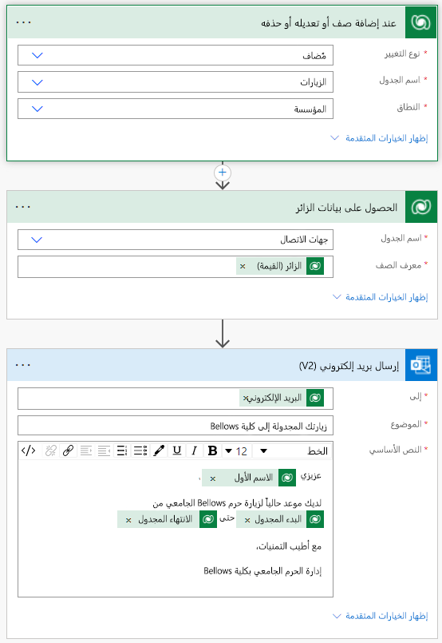

---
lab:
  title: 'النشاط المعملي 4: كيفية إنشاء حل تلقائي'
  module: 'Module 4: Get Started with Power Automate'
---

# النشاط المعملي 4: كيفية إنشاء حل تلقائي

**مستأجرو WWL - شروط الاستخدام** إذا تم تزويدك بمستأجر كجزء من تقديم تدريب بقيادة مدرب، يرجى ملاحظة أن المستأجر متاح لغرض دعم المختبرات العملية في التدريب الذي يقوده المعلم. يجب عدم مشاركة المستأجرين أو استخدامها لأغراض خارج المختبرات العملية. المستأجر المستخدم في هذه الدورة التدريبية هو مستأجر تجريبي ولا يمكن استخدامه أو الوصول إليه بعد انتهاء الفئة وغير مؤهل للامتداد. يجب عدم تحويل المستأجرين إلى اشتراك مدفوع. يظل المستأجرون الذين تم الحصول عليها كجزء من هذه الدورة التدريبية ملكا ل Microsoft Corporation ونحتفظ بالحق في الحصول على حق الوصول والمستودعات في أي وقت. 

## السيناريو

Bellows College مؤسسة تعليمية يضم حرمها الجامعي العديد من المباني. يتم حاليًا تسجيل زوار الحرم الجامعي في دفاتر عمل ورقية. ولا يتم جمع المعلومات بشكل متسق، ولا توجد وسيلة لجمع وتحليل البيانات المتعلقة بالزيارات عبر الحرم الجامعي بأكمله.

ترغب إدارة الحرم الجامعي في تحديث نظام تسجيل الزوار، بحيث يتم التحكم في الوصول إلى المباني من قبل أفراد الأمن، ويجب أن تكون جميع الزيارات مسجلة مسبقًا ويتم تسجيلها من قبل مضيفيها.

خلال هذه الدورة التدريبية، ستقوم بإنشاء تطبيقات وتفعيل التشغيل الآلي لتمكين موظفي إدارة وأمن Bellows College من إدارة الوصول إلى مباني الحرم الجامعي والتحكم فيه.

في هذا التمرين المعملي، ستقوم بإنشاء تدفق Power Automate لإرسال بريد إلكتروني إلى زائر عند جدولة الزيارة.

## خطوات معملية عالية المستوى

تم تحديد التالي كمتطلبات يجب عليك تنفيذها لإكمال المشروع:

- يجب إعلام جهات الاتصال عبر البريد الإلكتروني عند جدولة الزيارة.

## المتطلبات الأساسية

- إكمال **الوحدة 0 المختبر 0 - التحقق من صحة بيئة المختبر**
- إكمال **الوحدة 2 النشاط المعملي 1 - نمذجة البيانات**
- إكمال **الوحدة 2 النشاط المعملي 3 - كيفية إنشاء تطبيق يستند إلى النموذج**
- تم إنشاء جهة اتصال John Doe بعنوان بريد إلكتروني شخصي تم ملؤه.

## التمرين 1: إنشاء تدفق Visit Notification

**Objective:** في هذا التمرين، سوف تنشئ تدفق Power Automate ينفذ المتطلبات. ينبغي إرسال بريد إلكتروني للزائر يتضمن الرمز الفريد المخصص للزيارة فور إنشاء الزيارة.

### المهمة \#1: إنشاء تدفق

1.  انتقل إلى ⁧<https://make.powerapps.com>⁩. قد تحتاج إلى إعادة المصادقة، وحدد **تسجيل الدخول** واتبع الإرشادات إذا لزم الأمر.

2.  حدد بيئة **الممارسة (الأحرف الأولى من اسمي)** في أعلى اليمين، إذا لم تكن محددةً بالفعل.

3.  في شريط التنقل الأيسر، حدد **تدفقات**.

4.  إذا تمت مطالبتك، فحدد **بدء الاستخدام**.

5.  حدد **+ New flow** وحدد **Automated cloud flow**.

6.  أدخل `Visit Notification` **لاسم التدفق**.

7.  في **اختيار مشغل التدفق الخاص بك**، ابحث عن `Dataverse`

8.  اختر المشغل **عند إضافة صف أو تعديله أو حذفه**، ثم حدد **إنشاء**.

9.  بادر بملء شروط المشغل للتدفق:

    1.  تحديد **Added** لـ **Change type**

    2.  حدد **الزيارات** في **اسم الجدول**

    3.  حدد **المنظمة** في **النطاق**

    4.  في خطوة المشغل، حدد علامة الحذف (**...**) وحدد **إعادة تسمية**. إعادة تسمية خطوة المشغل `When a Visit is added` 

        هذه ممارسة جيدة، لذا يمكنك أنت ومحررو التدفق الآخرون فهم الغرض من الخطوة دون الحاجة إلى الخوض في التفاصيل.

### المهمة \#2: بادر بإنشاء خطوة صف "الوصول إلى الزائر"

1.  حدد **New step+**. ستسترد هذه الخطوة معلومات الزائر، بما في ذلك عنوان البريد الإلكتروني.

2.  ابحث عن `Dataverse`

3.  حدد إجراء **الوصول إلى صف حسب المعرّف**.

4.  حدد **جهات الاتصال** في **اسم الجدول**

5.  حدد الحقل **معرف الصف**. لاحظ أن نافذة تنبثق لتحديد **المحتوى الديناميكي** أو **التعبيرات**.

6.  في حقل **معرف الصف** ، حدد **الزائر (القيمة)** من قائمة **المحتوى الديناميكي** . في هذه الخطوة، تبحث عن جهة الاتصال لصف الزيارة الذي تم إنشاؤه لتشغيل هذا التدفق. نظرا لأن عنوان البريد الإلكتروني هو جزء من جدول جهات الاتصال، فستحتاج إلى هذه المعلومات لإرسال البريد الإلكتروني إلى الزائر.

7.  في الإجراء **Get a row by ID** ، حدد علامة الحذف (**...**) وحدد **Rename**. إعادة تسمية هذا الإجراء `Get the Visitor`
 
    هذه ممارسة جيدة، لذا يمكنك أنت ومحررو التدفق الآخرون فهم الغرض من الخطوة دون الحاجة إلى الخوض في التفاصيل.

### المهمة \#3: إنشاء خطوة لإرسال بريد إلكتروني إلى الزائر

1.  حدد **New step+**. هذه هي الخطوة التي ستنشئ رسالة بريد إلكتروني وترسلها للزائر.

2.  ابحث `mail`عن ، وحدد الإجراء **إرسال بريد إلكتروني (V2)** من **موصل outlook Office 365**.

3.  إذا تمت مطالبتك بقبول الشروط والأحكام لاستخدام هذا الإجراء، فحدد **قبول**.

4.  حدد **إضافة محتوى ديناميكي** ضمن الحقل **إلى**. 
    
5.  حدد **البريد الإلكتروني** من قائمة المحتوى الديناميكي.

    > لاحظ أنه يوجد أسفل عنوان **الوصول إلى الزائر**. هذا يعني أنك تختار البريد الإلكتروني المرتبط بالزائر الذي بحثت عنه في الخطوة السابقة.

7.  في حقل **الموضوع** ، أدخل `Your scheduled visit to Bellows College`

8.  أدخل النص التالي في **نص البريد الإلكتروني**:

    > يتعين وضع المحتوى الديناميكي حيث تتم تسمية الحقول بين قوسين. يوصى بنسخ كل النص ولصقه أولاً ثم إضافة المحتوى الديناميكي في الأماكن الصحيحة.

    ~~~~~~~~~~~~~~~~~~~~~~~~~~~~~~~~~~~~~~~~~~~~~~~~~~~~~~~~~~~~~~~~~~~~~~~~~~~~~~~~
    Dear {First Name},

    You are currently scheduled to visit Bellows Campus from {Scheduled Start} until {Scheduled End}.

    Best regards,

    Campus Administration
    Bellows College
    ~~~~~~~~~~~~~~~~~~~~~~~~~~~~~~~~~~~~~~~~~~~~~~~~~~~~~~~~~~~~~~~~~~~~~~~~~~~~~~~~

8.  بادر بتمييز النص **{First Name}** . استبدله بالحقل **الاسم الأول** من خطوة **الوصول إلى الزائر**.

9.  بادر بتمييز نص **{Scheduled Start}** . استبدله بالحقل **بدء المجدول** **عند إضافة خطوة زيارة**.

10.  بادر بتمييز نص **{Scheduled End}** . استبدله بالحقل **الانتهاء المجدول** من الخطوة **عند إضافة زيارة**.

11.  حدد ⁧**⁩حفظ⁧**⁩.

اترك علامة تبويب التدفق مفتوحة من أجل المهمة التالية. ينبغي أن يبدو تدفقك كما يلي تقريبًا:

### المهمة \#4: التحقق من صحة التدفق واختباره

1.  افتح علامة تبويب جديدة في متصفحك وانتقل إلى <https://make.powerapps.com>.

2.  حدد بيئة **الممارسة (الأحرف الأولى من اسمي)** في أعلى اليمين، إذا لم تكن محددةً بالفعل.

3.  حدد **التطبيقات** وافتح التطبيق المستند إلى نموذج **Bellows Campus Management** الذي أنشأته سابقا.

3.  اترك علامة تبويب المستعرض مفتوحة، وانتقل مرة أخرى إلى علامة التبويب السابقة التي بها تدفقك.

4.  في شريط الأوامر، حدد **Test**. حدد **يدويا** ثم حدد **اختبار**.

5.  انتقل إلى علامة تبويب المستعرض باستخدام التطبيق المستند إلى النموذج. 

6.  باستخدام التنقل في خريطة الموقع على اليسار، حدد **زيارات**.

6.  حدد الزر **+ جديد** لإضافة سجل **زيارة** جديد.

7.  أكمل سجل "الزيارة" كما يلي:

    -   **اسم:** `Test Visit`

    -   **الزائر:** John Doe

    -   **البداية المجدولة:** غداً الساعة 8:00 صباحاً

    -   **النهاية المجدولة:** غداً الساعة 9:00 صباحاً

8.  حدد الزر **حفظ & إغلاق** .

9.  انتقل إلى علامة تبويب المستعرض حيث يتم تشغيل اختبار التدفق. بعد لحظات تأخير، يجب أن ترى التدفق قيد التشغيل. تستطيع من هذا المكان تحديد أي مشكلات في التدفق أو التأكد أمن نجاح التشغيل.

    بعد تأخير وجيز، يجب أن تشاهد رسالة بريد إلكتروني في صندوق الوارد لديك، نظراً لأنك أدخلت البريد الإلكتروني لـ John Doe كبريدك الإلكتروني الشخصي. لاحظ أن الرسالة قد تنتقل إلى مجلد البريد الإلكتروني غير الهام.

## التحدي

- جرب التنسيق على البريد الإلكتروني. كيف يمكنك أن تجعله يبدو أكثر احترافية؟

