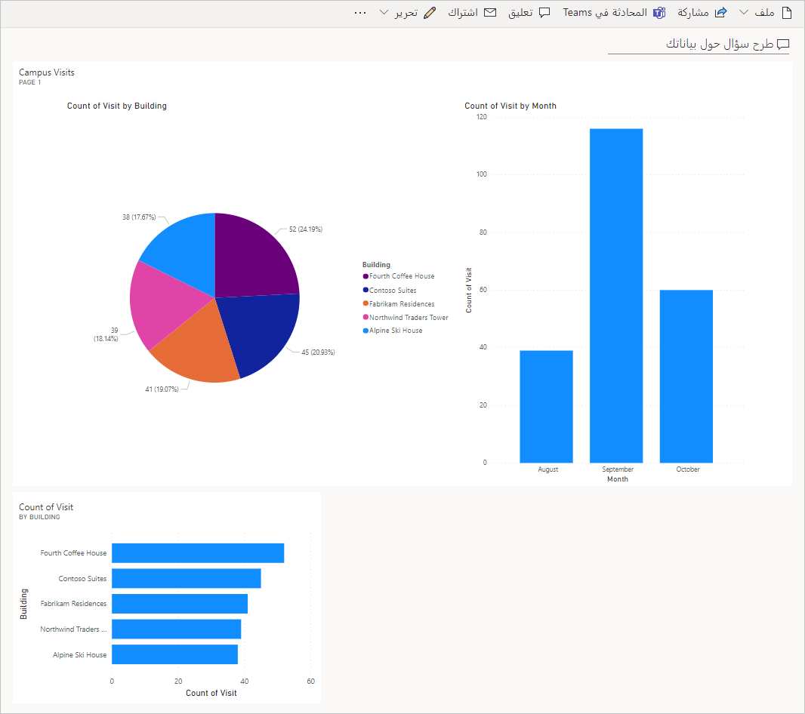

---
lab:
  title: 'النشاط المعملي 5: كيفية إنشاء لوحة معلومات بسيطة'
  module: 'Module 5: Get Started with Power BI'
ms.openlocfilehash: 2fb53fa9130cae4a711b11f341ea663f019c94c8
ms.sourcegitcommit: 8a89b7eacd1a65eaa7c5d6bff0dc7254991c4dde
ms.translationtype: HT
ms.contentlocale: ar-SA
ms.lasthandoff: 07/15/2022
ms.locfileid: "147154437"
---
## النشاط المعملي 5: كيفية إنشاء لوحة معلومات بسيطة

## السيناريو

Bellows College مؤسسة تعليمية يضم حرمها الجامعي العديد من المباني. يتم حاليًا تسجيل زوار الحرم الجامعي في دفاتر عمل ورقية. ولا يتم جمع المعلومات بشكل متسق، ولا توجد وسيلة لجمع وتحليل البيانات المتعلقة بالزيارات عبر الحرم الجامعي بأكمله.

ترغب إدارة الحرم الجامعي في تحديث نظام تسجيل الزوار، بحيث يتم التحكم في الوصول إلى المباني من قبل أفراد الأمن، ويجب أن تكون جميع الزيارات مسجلة مسبقًا ويتم تسجيلها من قبل مضيفيها.

خلال هذه الدورة التدريبية، ستقوم بإنشاء تطبيقات وتفعيل التشغيل الآلي لتمكين موظفي إدارة وأمن Bellows College من إدارة الوصول إلى مباني الحرم الجامعي والتحكم فيه.

في هذا النشاط المعملي، ستقوم بإنشاء تقرير ولوحة معلومات Power BI تُصور البيانات المتعلقة بزيارات الحرم الجامعي.

## خطوات معملية عالية المستوى

سنتبع الخطوات أدناه لتصميم لوحة معلومات Power BI وإنشائها:

-   إنشاء تقرير ذي مرئيات متعددة لمعلومات زيارات الحرم الجامعي

-   استخدام استعلام بلغة طبيعية للمستخدم لإنشاء مرئيات إضافية

## المتطلبات الأساسية

- إكمال **الوحدة 0 المختبر 0 - التحقق من صحة بيئة المختبر**
- إكمال **الوحدة 2 النشاط المعملي 1 - نمذجة البيانات**

## الأشياء الواجب مراعاتها قبل البدء

-   من الجمهور المستهدف من التقرير؟
-   كيف سيستهلك الجمهور التقرير؟ هل هذا هو الجهاز الأمثل؟ الموقع؟
-   هل لديك بيانات كافية لجعلها مرئية؟
-   ما الخصائص المحتملة التي يمكنك استخدامها لتحليل البيانات المتعلقة بالزيارات؟

## التمرين 1: إنشاء تقرير Power BI

**Objective:** في هذا التمرين، ستنشئ تقرير Power BI استناداً إلى بيانات جدول بيانات Excel الذي استخدمناها في تمرينٍ سابقٍ.

### المهمة \#1: إعداد خدمة Power BI

1.  قم بتنزيل [visit.pbix](https://github.com/MicrosoftLearning/PL-900-Microsoft-Power-Platform-Fundamentals/raw/master/Allfiles/visits.pbix) واحفظه على الكمبيوتر لديك.

2.  انتقل إلى <https://app.powerbi.com/> وسجِّل الدخول إذا لزم الأمر.

3.  في الزاوية اليسرى السفلية من الشاشة، حدد **الوصول إلى البيانات**

4.  حدد الزر **الوصول** ضمن **الملفات**، في قسم **إنشاء محتوى جديد**.

5.  حدد **ملف محلي**.

6.  حدد موقع ملف **visits.pbix** الذي نزلته مسبقًا وحدده.

7.  بمجرد اكتمال تحميل البيانات، قم بتوسيع **مساحة عملي** وحدد تقرير **الزيارات** (لاحظ أن النوع معين إلى **تقرير**).

8.  انقر فوق **Edit**. إذا لم يكن عنصر القائمة **Edit** مرئيًا، فانقر فوق **...** ثم حدد **Edit**.

لقد قمت الآن بإعداد خدمة Power BI لاستخدامها في أنشطتك المعملية.

### المهمة \#2: إنشاء مرئيات المخطط والوقت

1.  اضغط على أيقونة **المخطط الدائري** في لوحة **المرئيات** لإدراج مخطط.

2.  اضغط على سهم القائمة المنسدلة بجانب **bc_Building** في جزء "الحقول". اسحب حقل **المبنى** وأسقطه في مربع **وسيلة الإيضاح**.

3.  اضغط على سهم القائمة المنسدلة بجانب **bc_Visit** في جزء "الحقول". اسحب حقل **الزيارة** وأفلته في مربع **القيم**.

4.  غيّر حجم المخطط الدائري باستخدام مؤشرات الزاوية بحيث تكون جميع مكونات المخطط مرئية.

5.  انقر فوق التقرير خارج المخطط الدائري لإلغاء تحديده وحدد مخطط عمودي مكدس في جزء **المرئيات**.

6.  اضغط على سهم القائمة المنسدلة بجانب **bc_Visit** في جزء "الحقول". اسحب حقل **Visit** وأفلته في مربع الهدف **Y-axis**.

7.  اسحب حقل **Start** وأفلته في مربع الهدف **X-axis**.

8.  في جزء "المرئيات"، انقر فوق **x** بجوار **السنة** و **الربع** لتترك فقط إجماليات **الشهر** و **اليوم** للمحور.

9.  غيّر حجم المخطط حسب الرغبة باستخدام مؤشرات الزاوية.

10. اختبر تفاعل التقرير:

    1.  حدد شرائح البنية المتنوعة على المخطط الدائري ولاحظ التغييرات في تقرير الوقت.

    2.  انقر فوق المخطط العمودي. اضغط على سهم القائمة المنسدلة لتشغيل وضع **التنقل لأسفل**، (أو انقر بزر الماوس الأيمن على المخطط وحدد **التنقل لأسفل**)، ثم انقر فوق العمود للتنقل التفصيلي إلى المستوى التالي (الأيام).

    3.  انتقل لأعلى ولأسفل وحدد أشرطة مختلفة في المخطط العمودي للوقت لملاحظة التغييرات في التقرير الدائري.

11. احفظ العمل قيد التقدم بالضغط على **حفظ**.

## التمرين 2: إنشاء لوحة معلومات Power BI

### المهمة \#1: إنشاء لوحة معلومات Power BI

1.  ينبغي أن يكون التقرير مفتوحًا من المهمة السابقة.

2.  حدد **التثبيت في لوحة المعلومات** في القائمة. اعتمادا على التخطيط قد تحتاج إلى الضغط **...** لإظهار عناصر القائمة إضافية.

3.  حدد **لوحة معلومات جديدة** في مطالبة **التثبيت في لوحة المعلومات**.

4.  أدخِل **إدارة الحرم الجامعي** لـ **اسم لوحة المعلومات**، واضغط على **التثبيت المباشر**.

5.  ستطالبك نافذة منبثقة بإنشاء لوحة المعلومات. حدد **الانتقال إلى لوحة المعلومات**.

6.  اختبار تفاعل المخططات الدائرية والشريطية المعروضة.

### المهمة \#2: إضافة مرئيات باستخدام لغة طبيعية

1.  في لوحة المعلومات **Campus Management**، حدد شريط **طرح سؤال عن بياناتك** في الجزء العلوي.

2.  أدخل **المباني حسب عدد الزيارات** في جزء Q&A. سيتم عرض مخطط الشريط.

3.  حدد **تثبيت المرئيات**.

4.  حدد **لوحة معلومات حالية**، حدد لوحة المعلومات **إدارة الحرم الجامعي**، واضغط على **تثبيت**.

5.  انقر فوق **الخروج من Q&A**.

يجب عرض لوحة معلومات **إدارة الحرم الجامعي** خاصتك مع ثلاث عناصر تحكم عليها. قد تضطر إلى التمرير لأسفل لرؤية مرئيات Q&A الجديدة.

ينبغي أن تبدو لوحة المعلومات الخاصة بك مماثلة لما يلي:

