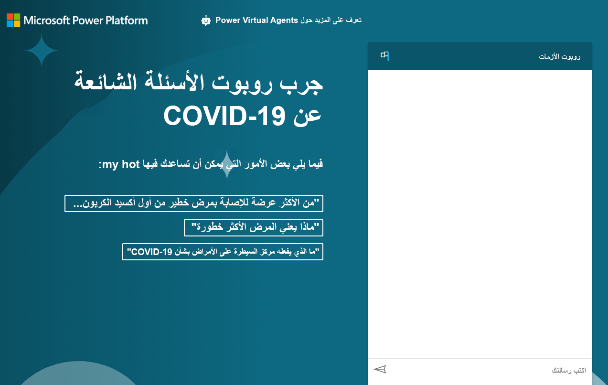

---
lab:
  title: 'النشاط المعملي 8: كيفية إنشاء روبوت دردشة ينفذ الوظائف الأساسية'
  module: 'Module 6: Intro to Power Virtual Agents'
ms.openlocfilehash: ed1611f4b1450093a6e95cbb9df7ad7fdc040e86
ms.sourcegitcommit: ef58c858463b890e923ef808b1d43405423943fd
ms.translationtype: HT
ms.contentlocale: ar-SA
ms.lasthandoff: 01/27/2022
ms.locfileid: "137898770"
---
# <a name="module-6-intro-to-power-virtual-agents"></a>الوحدة 6: مقدمة إلى Power Virtual Agents
## <a name="lab-how-to-build-a-basic-chatbot"></a>نشاط معملي: كيفية إنشاء روبوت دردشة ينفذ الوظائف الأساسية

# <a name="scenario"></a>السيناريو

Bellows College مؤسسة تعليمية يضم حرمها الجامعي العديد من المباني. يتم تسجيل زيارات الحرم الجامعي حاليًا في دفاتر ورقية. ولا يتم جمع المعلومات بشكل متسق، ولا توجد وسيلة لجمع وتحليل البيانات المتعلقة بالزيارات عبر الحرم الجامعي بأكمله.

مثل معظم المؤسسات، تستجيب Bellows College بسرعة للمخاوف المتعلقة بالمعلومات الخاطئة عن كوفيد-19 وأفضل الممارسات والجداول وما إلى ذلك. في هذا النشاط المعملي، سوف تقوم بإنشاء روبوت دردشة Power Virtual Agent الذي سيشير إلى صفحة مركز السيطرة على الأمراض التي بها أسئلة وإجابات تتعلق بالحالة الحالية للجائحة. سوف تريد الكلية هذا الإعداد، بحيث يمكن أن يتم تضمينه في موقع المدخل الخاص بهم، بالإضافة إلى إتاحته بشكل مخصص حيث تؤدي الأقسام إعادة الافتتاح المخططة الخاصة بها.

## <a name="high-level-steps"></a>خطوات عالية المستوى

سوف نتبع المخطط أدناه لإنشاء Power Virtual Agent الخاص بنا:

  - التسجيل للحصول على إصدار تجريبي من Power Virtual Agent

  - إنشاء روبوت باستخدام الأسئلة المتداولة

  - اختبار الروبوت

  - تغيير التحية الافتراضية

  - نشر الروبوت

  - **تحدي إضافي:** تضمين الروبوت في المدخل الخاص بك

## <a name="prerequisites"></a>المتطلبات الأساسية

تم تحديد التالي كمتطلبات يجب عليك تنفيذها لإكمال المشروع:

  - إكمال **الوحدة 0 المختبر 0 - التحقق من صحة بيئة المختبر**

  - إكمال **الوحدة 2 المختبر 1 - مقدمة إلى Microsoft Dataverse**

  - تمرين إضافي فقط: إكمال **الوحدة 6 المختبر 4 - مقدمة إلى مداخل Power Apps** 

## <a name="things-to-consider-before-you-begin"></a>الأشياء الواجب مراعاتها قبل البدء

يمكن أن تكون الروبوتات مفيدة جدًا في العديد من السيناريوهات المختلفة. بناءً على ما تعرفه حتى الآن عن Bellows College، فكر ما الأماكن الأخرى في المؤسسة التي يمكن أن يكون الروبوت فيها مفيدًا.

# <a name="exercise-1-sign-up-for-pva-and-create-a-new-bot"></a>التمرين \#1: التسجيل في PVA وإنشاء روبوت جديد

في هذا التمرين، ستسجل في الإصدار التجريبي لـ Power Virtual Agents.

1.  انتقل إلى [Power Virtual Agents](https://powerva.microsoft.com/)

2.  انقر فوق **بدء تشغيل الإصدار التجريبي المجاني**.

3.  سجل الدخول، إذا لزم الأمر.

4. ينبغي أن تظهر نافذة **إنشاء روبوت جديد**.

5. أدخل **Crisis Bot** في خانة **الاسم** وحدد لغة.

6. حدد بيئة تدريبك لإنشاء الروبوت وانقر فوق **إنشاء**. انتظر إنشاء الروبوت. انقر فوق **استكشاف الروبوت** إذا طلب منك.

7. اختبر الروبوت. اكتب **Hello** في مربع المراسلة وانقر فوق **Send**. يجب أن يرحب بك الروبوت ويخبرك بما يمكنه فعله.

8. أغلق **الدردشة**.

9. حدد «**Topics**». يأتي الروبوت مع عينة من بعض مواضيع المستخدم وبعض مواضيع النظام. تأتي التحية الافتراضية من مواضيع النظام.

> في التمرين التالي، سوف تنشئ مواضيعك الخاصة من الأسئلة المتداولة على موقع مركز السيطرة على الأمراض (CDC). لا تنتقل بعيدًا عن نافذة المتصفح هذه.

# <a name="exercise-2-create-topics"></a>التمرين \#2: إنشاء مواضيع

في هذا التمرين، سوف تنشئ مواضيع من الأسئلة المتداولة على موقع CDC.

1.  في علامة تبويب جديدة، انتقل إلى [الأسئلة المتداولة على موقع CDC](https://www.cdc.gov/coronavirus/2019-ncov/faq.html)وافحص ما هو موجود على الموقع. سوف تنشئ مواضيعك من هذه الأسئلة المتداولة.

2.  انسخ عنوان URL.

3.  ارجع إلى Power Virtual Agents وتأكد من أنه لا يزال لديك **مواضيع** محددة.

4.  حدد علامة التبويب **المقترحة**، أسفل **المواضيع**.

5.  انقر فوق **البدء.**

6. ألصق عنوان URL الذي نسخته في مربع نص **رابط إلى المحتوى على الإنترنت** وانقر فوق **إضافة**. لاحظ أنه إذا قمت بنسخ عنوان URL الكامل، سيتم إدراج https:// مرتين. تأكد من أن عنوان URL يدرج البروتوكول مرة واحدة فقط.

7.  انقر فوق **البدء** وانتظر. قد يستغرق هذا بضع دقائق.

8.  ينبغي أن تحصل على بعض المواضيع المقترحة لك. انقر لفتح أحد المواضيع المقترحة.

9. ينبغي أن ترى عبارة التشغيل وما سيكون رد الروبوت. **انقر فوق Add to topics.**
    
10. يجب إضافة الموضوع المقترح إلى مواضيعك. حدد كل المواضيع المقترحة وانقر فوق **إضافة إلى المواضيع** 

    > يمكنك تحديد جميع المواضيع باستخدام الأيقونة الموجودة على يسار عمود الاسم. إذا تلقيت رسالة خطأ، فيرجى المحاولة مرة أخرى.

11. بمجرد إضافة المواضيع المقترحة، حدد علامة التبويب **الحالية**. ينبغي أن ترى المواضيع الجديدة مع تعيين حالتها على إيقاف التشغيل.

12. استخدم زر التبديل في عمود **الحالة** من أجل **تشغيل** بعض المواضيع. 

13. اكتب عبارة التشغيل لأحد المواضيع التي شغلتها حتى تتمكن من اختبارها لاحقًا.

> لا تنتقل بعيدًا عن نافذة المتصفح هذه.

# <a name="exercise-3-test-topics"></a>التمرين \#3: مواضيع الاختبار

في هذه المهمة، ستختبر المواضيع التي أضفتها.

1.  انقر فوق **اختبار الروبوت** إلى أسفل اليسار.

2.  انقر فوق **Reset**.

3.  اكتب عبارة التشغيل التي سجلتها من المهمة السابقة وانقر فوق **إرسال**.

4.  ينبغي أن يمنحك الروبوت المعلومات الصحيحة، ويسألك عما إذا كان قد أجاب على سؤالك. انقر فوق ⁧**⁩نعم⁧**⁩.

5.  ينبغي أن يسألك الروبوت عن معدل أدائه. أعطه تصنيفًا ممتازًا.

6.  ينبغي أن يسألك الروبوت عما إذا كان يمكنه مساعدتك في أي شيء آخر. انقر فوق **لا، شكرًا**.

7.  يجب أن يختتم الروبوت جلسة الدردشة.

8.  اكتب **مرحبًا** وانقر فوق **إرسال**.

9.  يجب أن يرحب بك الروبوت ويخبرك بما يمكنه فعله. يمكن أن يساعد الروبوت المستخدمين الآن في الأسئلة الشائعة حول COVID-19، لذلك ستحتاج إلى تغيير رسالة الترحيب في المهمة التالية. لا تنتقل بعيدًا عن نافذة المتصفح هذه.

# <a name="exercise-4-change-the-greeting"></a>التمرين \#4: تغيير الترحيب

في هذه المهمة، سوف تغير التحية إلى تحية خاصة بكوفيد-19.

1.  تأكد من تحديد **المواضيع** وحدد علامة التبويب **الحالية**.

2.  اطوِ قسم **مواضيع المستخدم**.

3.  انقر لفتح موضوع **التحية** من مواضيع النظام. يمكنك أيضًا استخدام مربع البحث من أجل **البحث في المواضيع الحالية**.

4.  يحتوي موضوع التحية على 52 عبارة تشغيل، انقر فوق **الذهاب إلى أداة التأليف**.

5.  انتقل إلى الرسالة الأولى واستبدلها بـ `Hi, I’m a virtual agent. I can tell you about how COVID-19 spreads, how to protect yourself, preparing your home and family for COVID-19, symptoms, testing, and more.`

6.  انقر فوق ⁧**⁩حفظ⁧**⁩.

7.  انقر فوق **اختبار الروبوت** إذا كان الروبوت ما زال لا يعمل. انقر فوق **إعادة التعيين** لإعادة تعيين الدردشة.

8.  اكتب مرحبًا وانقر فوق **إرسال**.

9.  يجب أن يرد الروبوت الآن بالتحية الجديدة.

# <a name="exercise-5-publish-the-bot"></a>التمرين \#5: نشر الروبوت

في هذا التمرين، ستنشر الروبوت.

1.  حدد **نشر** على شريط التنقل الأيسر.

2.  انقر على **نشر**.

3.  انقر فوق **نشر** مجددًا وانتظر حتى يكتمل النشر.

4.  وسع **الإدارة** على شريط التنقل الأيسر وحدد **القنوات**.

5.  ستحصل على قائمة بالقنوات المتاحة التي يمكنك نشر الروبوت الخاص بك عليها. حدد **موقع العرض التجريبي**.

6.  تغيير رسالة الترحيب إلى `Try my COVID-19 FAQ bot.`

7.  أدخل التالي في **بادئات المحادثة**:
    ```
     “Who is at higher risk for serious illness from COVID-19”
     “What does more severe illness mean”
     “What is the CDC doing about COVID-19”
    ```
    
8.  انقر فوق ⁧**⁩حفظ⁧**⁩.

9.  انسخ عنوان **URL**.

> يمكنك مشاركة عنوان URL مع زملائك والحصول على ملاحظات منهم. 

10.  ابدأ نافذة أو علامة تبويب متصفح جديدة وانتقل إلى عنوان URL الذي نسخته. ينبغي أن يكون موقع العرض التجريبي مشابهًا للصورة أدناه.

11. انطلق وابدأ الدردشة مع الروبوت.  
    
عند الانتهاء، ينبغي أن يبدو الروبوت المنشور مشابهًا لما يلي:



# <a name="challenges"></a>التحديات 
* تضمين روبوت الدردشة الخاص بك على مدخل Bellows College Visitors (مزيد من المعلومات حول كيفية القيام بذلك ضمن **Add bot to Power Apps** [هنا](https://docs.microsoft.com/en-us/power-virtual-agents/publication-connect-bot-to-web-channels).)
